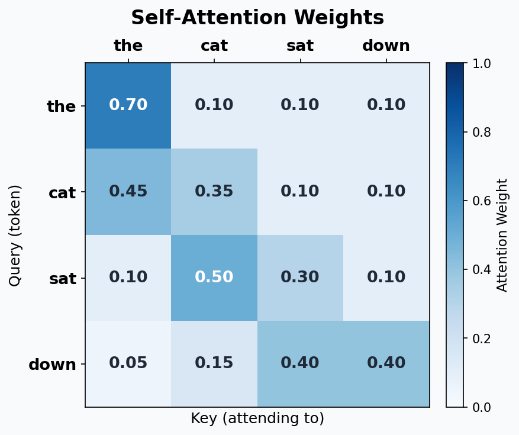
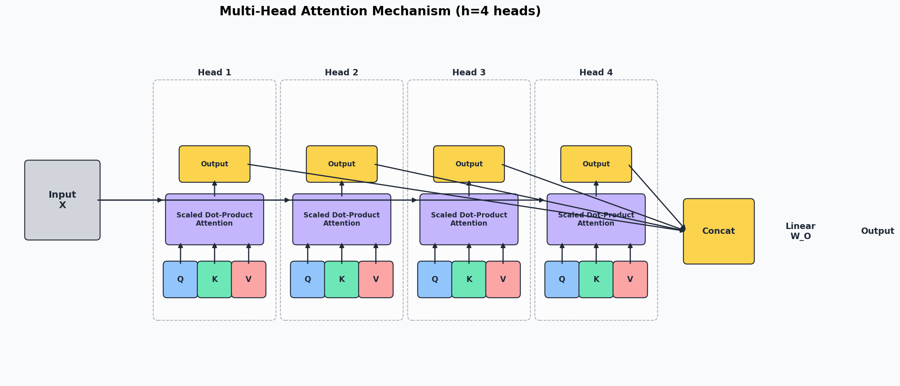
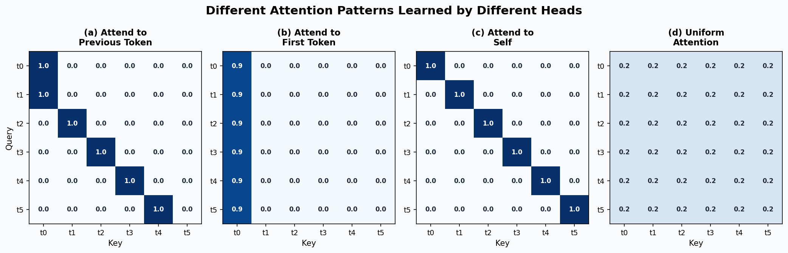
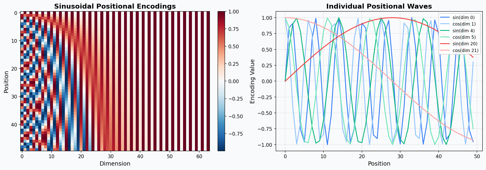
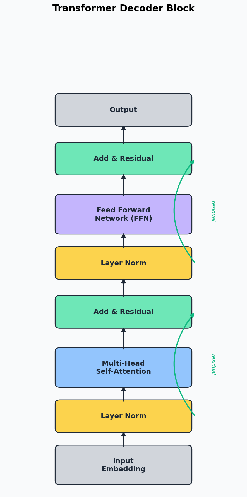
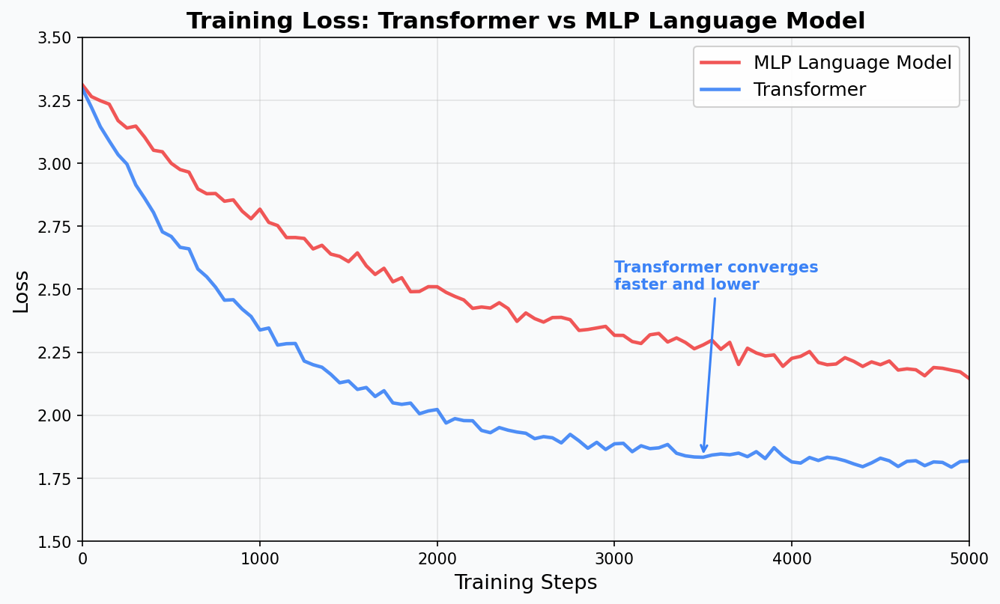

# Day 3: Transformers - The Core of All GenAI

## The Book - From Attention Mechanisms to Building Your Own GPT

> **What you need:** Python, PyTorch, matplotlib, the `names.txt` dataset from Day 2
> **What you'll build today:** A decoder-only Transformer (mini GPT) for character-level name generation
> **Time:** ~12 hours

---

## Table of Contents

1. [Why Transformers Matter](#1-why-transformers-matter)
2. [The Big Picture](#2-the-big-picture)
3. [Chapter 1: The Problem with MLPs for Sequences](#chapter-1-the-problem-with-mlps-for-sequences)
4. [Chapter 2: Self-Attention - The Key Innovation](#chapter-2-self-attention---the-key-innovation)
5. [Chapter 3: Scaled Dot-Product Attention](#chapter-3-scaled-dot-product-attention)
6. [Chapter 4: Multi-Head Attention](#chapter-4-multi-head-attention)
7. [Chapter 5: Positional Encoding](#chapter-5-positional-encoding)
8. [Chapter 6: The Transformer Block](#chapter-6-the-transformer-block)
9. [Chapter 7: Building a Mini GPT](#chapter-7-building-a-mini-gpt)
10. [Chapter 8: Training the Mini GPT](#chapter-8-training-the-mini-gpt)
11. [Chapter 9: Comparing with Day 2's MLP](#chapter-9-comparing-with-day-2s-mlp)
12. [Chapter 10: Exercises & Experiments](#chapter-10-exercises--experiments)
13. [References & Next Steps](#references--next-steps)
14. [Interview Prep: Key Terms & Concepts](#interview-prep-key-terms--concepts-for-day-3)

---

## 1. Why Transformers Matter

Every single frontier AI model you have heard of is a Transformer:

```
GPT-4, GPT-4o          - Transformer
Claude 3.5, Claude 4    - Transformer
Gemini                  - Transformer
LLaMA 3                 - Transformer
Stable Diffusion        - Transformer (DiT) / U-Net with attention
DALL-E 3                - Transformer
Whisper (speech)        - Transformer
AlphaFold (proteins)    - Transformer
```

Before Transformers (introduced in the 2017 paper "Attention Is All You Need"), the state of the art for sequences was RNNs and LSTMs. Transformers replaced them entirely because they are:

1. **Parallelizable** - all positions compute at once (RNNs must go step by step)
2. **Better at long-range dependencies** - attention connects any two positions directly
3. **Scalable** - performance improves predictably with more data and compute

Today you will understand every component of a Transformer and build one from scratch in PyTorch.

## 2. The Big Picture

Yesterday you built an MLP language model that looks at the previous N characters through a fixed window. Today you will build a Transformer that can attend to ALL previous characters simultaneously and learn WHICH ones matter for each prediction.

```
Day 2 MLP:
  Fixed window of 3 chars -> concatenate embeddings -> hidden layer -> predict next char
  Problem: context is fixed, position information is implicit in concatenation order

Day 3 Transformer:
  ALL previous chars -> self-attention (learns what to focus on) -> predict next char
  Advantage: dynamic context, explicit position encoding, much more powerful
```

The key ingredient is **self-attention**: a mechanism where each token asks "which other tokens in the sequence should I pay attention to?"

---

## Chapter 1: The Problem with MLPs for Sequences

Before we build something better, let us understand exactly why the Day 2 MLP has limitations.

### Problem 1: Fixed Context Window

```
Day 2 MLP with block_size=3:

  Input:  "alexandr" -> predict 'a'
  Model sees: ['n', 'd', 'r']  (only the last 3 characters)
  Model CANNOT see: ['a', 'l', 'e', 'x', 'a']

  The 'a' at the start of "alexandra" might be very informative!
  But with a fixed window of 3, it is invisible.
```

You could make the window larger, but:
- block_size=10 means the first hidden layer has `10 * n_embd` inputs
- block_size=50 means `50 * n_embd` inputs
- The number of parameters in W1 explodes linearly with context size

### Problem 2: No Weight Sharing Across Positions

```
In the MLP, position 1, position 2, and position 3 have completely separate weights:

  [emb_pos1 | emb_pos2 | emb_pos3] @ W1
  ^^^^^^^^   ^^^^^^^^   ^^^^^^^^
  Each position hits different columns of W1

If the model learns "the letter 'a' is a vowel" from position 1,
it does NOT automatically know this for position 2 or 3.
It must learn the same pattern separately for every position.
```

This is wasteful. Self-attention shares weights across all positions.

### Problem 3: Cannot Handle Variable-Length Input

```
MLP expects EXACTLY block_size inputs. Always.

  "a."          -> needs padding: ['.', '.', 'a']
  "christopher." -> needs truncation: only sees last 3 chars

A Transformer can naturally handle sequences of ANY length
(up to a maximum, but that maximum is a soft constraint, not architectural).
```

### Problem 4: No Interaction Between Input Positions

```
In the MLP, the 3 input embeddings are concatenated and then linearly combined.
The model cannot learn "if position 1 is 'q', then position 2 is probably 'u'."

Each position's embedding is processed INDEPENDENTLY until they all hit the hidden layer.
Self-attention lets every position communicate with every other position DIRECTLY.
```

### What We Need

We need a mechanism that:
1. Lets every position look at every other position
2. Shares weights across positions (what you learn at position 1 works at position 5)
3. Handles variable-length sequences naturally
4. Learns WHICH positions are relevant (not all equally)

That mechanism is **self-attention**.

---

## Chapter 2: Self-Attention - The Key Innovation

### The Core Idea

Self-attention answers the question: **for each token in the sequence, which other tokens should it pay attention to, and how much?**

Think of it like a room full of people. Each person (token) looks around the room and decides who to listen to. Some people are more relevant than others depending on what you are trying to figure out.

### The Three Vectors: Query, Key, Value

Every token produces three vectors:

```
Query (Q): "What am I looking for?"
Key (K):   "What do I contain?"
Value (V): "What information do I provide?"

The attention mechanism works like a search engine:
  1. Each token broadcasts a Query: "I need information about X"
  2. Each token broadcasts a Key: "I have information about Y"
  3. Compatibility = how well Query matches Key (dot product)
  4. High compatibility = high attention weight
  5. The output is a weighted sum of Values, using attention weights
```

### Step-by-Step Example with Real Numbers

Let us work through a concrete example with 4 tokens and 2-dimensional embeddings.

```
Sentence (4 tokens): ["the", "cat", "sat", "down"]

Token embeddings (2-dimensional, for simplicity):
  x_the  = [1.0, 0.0]
  x_cat  = [0.0, 1.0]
  x_sat  = [1.0, 1.0]
  x_down = [0.5, 0.5]

Stack them into a matrix X (4x2):
  X = [[1.0, 0.0],
       [0.0, 1.0],
       [1.0, 1.0],
       [0.5, 0.5]]
```

### Step 1: Create Q, K, V with Weight Matrices

We have three learnable weight matrices: W_Q, W_K, W_V, each of shape (2, 2) since our embedding dimension is 2.

```
Let's use these (normally learned, but we pick concrete values):

W_Q = [[1, 0],     W_K = [[0, 1],     W_V = [[1, 1],
       [0, 1]]            [1, 0]]            [0, 1]]

Compute Q, K, V for all tokens at once:

Q = X @ W_Q                    K = X @ W_K                    V = X @ W_V
  = [[1.0, 0.0],                = [[1.0, 0.0],                = [[1.0, 0.0],
     [0.0, 1.0],   @ [[1, 0],     [0.0, 1.0],   @ [[0, 1],     [0.0, 1.0],   @ [[1, 1],
     [1.0, 1.0],      [0, 1]]     [1.0, 1.0],      [1, 0]]     [1.0, 1.0],      [0, 1]]
     [0.5, 0.5]]                   [0.5, 0.5]]                   [0.5, 0.5]]

Q = [[1.0, 0.0],              K = [[0.0, 1.0],              V = [[1.0, 1.0],
     [0.0, 1.0],                   [1.0, 0.0],                   [0.0, 1.0],
     [1.0, 1.0],                   [1.0, 1.0],                   [1.0, 2.0],
     [0.5, 0.5]]                   [0.5, 0.5]]                   [0.5, 1.0]]
```

Let us verify one entry manually:
```
Q for "the":  [1.0, 0.0] @ [[1, 0], [0, 1]] = [1*1 + 0*0, 1*0 + 0*1] = [1.0, 0.0]  ✓
K for "cat":  [0.0, 1.0] @ [[0, 1], [1, 0]] = [0*0 + 1*1, 0*1 + 1*0] = [1.0, 0.0]  ✓
V for "sat":  [1.0, 1.0] @ [[1, 1], [0, 1]] = [1*1 + 1*0, 1*1 + 1*1] = [1.0, 2.0]  ✓
```

### Step 2: Compute Attention Scores (Q @ K^T)

The attention score between token i and token j is the dot product of Q_i and K_j. This measures "how much should token i attend to token j?"

```
Scores = Q @ K^T    (4x2) @ (2x4) = (4x4)

K^T = [[0.0, 1.0, 1.0, 0.5],
       [1.0, 0.0, 1.0, 0.5]]

Scores = Q @ K^T:

  Row 0 (the):  [1.0, 0.0] @ K^T = [0.0, 1.0, 1.0, 0.5]
  Row 1 (cat):  [0.0, 1.0] @ K^T = [1.0, 0.0, 1.0, 0.5]
  Row 2 (sat):  [1.0, 1.0] @ K^T = [1.0, 1.0, 2.0, 1.0]
  Row 3 (down): [0.5, 0.5] @ K^T = [0.5, 0.5, 1.0, 0.5]

Scores = [[0.0, 1.0, 1.0, 0.5],    <- "the" attends most to "cat" and "sat"
          [1.0, 0.0, 1.0, 0.5],    <- "cat" attends most to "the" and "sat"
          [1.0, 1.0, 2.0, 1.0],    <- "sat" attends most to itself (score=2.0)
          [0.5, 0.5, 1.0, 0.5]]    <- "down" attends most to "sat"
```

### Step 3: Apply Softmax to Get Attention Weights

Softmax converts raw scores to probabilities (each row sums to 1):

```
Weights = softmax(Scores, dim=-1)

Row 0: softmax([0.0, 1.0, 1.0, 0.5])
  exp: [1.000, 2.718, 2.718, 1.649]  sum = 8.085
  weights: [0.124, 0.336, 0.336, 0.204]

Row 1: softmax([1.0, 0.0, 1.0, 0.5])
  exp: [2.718, 1.000, 2.718, 1.649]  sum = 8.085
  weights: [0.336, 0.124, 0.336, 0.204]

Row 2: softmax([1.0, 1.0, 2.0, 1.0])
  exp: [2.718, 2.718, 7.389, 2.718]  sum = 15.543
  weights: [0.175, 0.175, 0.475, 0.175]

Row 3: softmax([0.5, 0.5, 1.0, 0.5])
  exp: [1.649, 1.649, 2.718, 1.649]  sum = 7.665
  weights: [0.215, 0.215, 0.355, 0.215]

Attention Weights:
  [[0.124, 0.336, 0.336, 0.204],    <- "the": 34% on cat, 34% on sat
   [0.336, 0.124, 0.336, 0.204],    <- "cat": 34% on the, 34% on sat
   [0.175, 0.175, 0.475, 0.175],    <- "sat": 48% on itself
   [0.215, 0.215, 0.355, 0.215]]    <- "down": 36% on sat
```



### Step 4: Compute Output (Weighted Sum of Values)

Each token's output is a weighted combination of ALL values, weighted by attention:

```
Output = Weights @ V    (4x4) @ (4x2) = (4x2)

V = [[1.0, 1.0],    <- value of "the"
     [0.0, 1.0],    <- value of "cat"
     [1.0, 2.0],    <- value of "sat"
     [0.5, 1.0]]    <- value of "down"

Output for "the" (row 0):
  = 0.124 * [1.0, 1.0] + 0.336 * [0.0, 1.0] + 0.336 * [1.0, 2.0] + 0.204 * [0.5, 1.0]
  = [0.124, 0.124] + [0.000, 0.336] + [0.336, 0.672] + [0.102, 0.204]
  = [0.562, 1.336]

Output for "cat" (row 1):
  = 0.336 * [1.0, 1.0] + 0.124 * [0.0, 1.0] + 0.336 * [1.0, 2.0] + 0.204 * [0.5, 1.0]
  = [0.336, 0.336] + [0.000, 0.124] + [0.336, 0.672] + [0.102, 0.204]
  = [0.774, 1.336]

Output for "sat" (row 2):
  = 0.175 * [1.0, 1.0] + 0.175 * [0.0, 1.0] + 0.475 * [1.0, 2.0] + 0.175 * [0.5, 1.0]
  = [0.175, 0.175] + [0.000, 0.175] + [0.475, 0.950] + [0.088, 0.175]
  = [0.738, 1.475]

Output for "down" (row 3):
  = 0.215 * [1.0, 1.0] + 0.215 * [0.0, 1.0] + 0.355 * [1.0, 2.0] + 0.215 * [0.5, 1.0]
  = [0.215, 0.215] + [0.000, 0.215] + [0.355, 0.710] + [0.108, 0.215]
  = [0.678, 1.355]

Final Output:
  [[0.562, 1.336],
   [0.774, 1.336],
   [0.738, 1.475],
   [0.678, 1.355]]
```

**What just happened?** Each token's output is now a context-aware representation. It is no longer just the token's own embedding; it is a blend of ALL tokens' values, with more weight on the relevant ones. "The" now carries information from "cat" and "sat". "Sat" carries information mostly from itself (it had the highest self-attention score).

### Self-Attention in PyTorch

```python
import torch
import torch.nn.functional as F

# Our 4 tokens, 2-dim embeddings
X = torch.tensor([[1.0, 0.0],
                   [0.0, 1.0],
                   [1.0, 1.0],
                   [0.5, 0.5]])

# Weight matrices (normally learned)
W_Q = torch.tensor([[1.0, 0.0], [0.0, 1.0]])
W_K = torch.tensor([[0.0, 1.0], [1.0, 0.0]])
W_V = torch.tensor([[1.0, 1.0], [0.0, 1.0]])

# Compute Q, K, V
Q = X @ W_Q   # (4, 2)
K = X @ W_K   # (4, 2)
V = X @ W_V   # (4, 2)

# Attention scores
scores = Q @ K.T  # (4, 4)
print("Raw attention scores:")
print(scores)

# Softmax to get weights
weights = F.softmax(scores, dim=-1)  # (4, 4)
print("\nAttention weights (each row sums to 1):")
print(weights)

# Weighted sum of values
output = weights @ V  # (4, 2)
print("\nOutput:")
print(output)
```

---

## Chapter 3: Scaled Dot-Product Attention

### The Formula

The full attention formula from "Attention Is All You Need":

```
Attention(Q, K, V) = softmax(Q @ K^T / sqrt(d_k)) @ V

Where:
  Q = queries     (shape: seq_len x d_k)
  K = keys        (shape: seq_len x d_k)
  V = values      (shape: seq_len x_v)
  d_k = dimension of keys (and queries)
  sqrt(d_k) = the scaling factor
```

### Why Scale by sqrt(d_k)?

This is crucial and often asked in interviews. Let us understand it with numbers.

```
When d_k is small (d_k = 2, like our example):
  Dot products are moderate: scores in range [-2, 2]
  Softmax produces gentle distributions: [0.12, 0.34, 0.34, 0.20]
  Gradients flow well. Training works.

When d_k is large (d_k = 512, like in real Transformers):
  Dot products become HUGE: scores in range [-100, 100]
  Softmax produces near-one-hot distributions: [0.00, 0.00, 1.00, 0.00]
  Gradients become nearly zero. Training breaks!
```

Why do dot products grow with dimension?

```
If Q and K have elements drawn from N(0, 1):
  Q = [q1, q2, ..., q_dk]
  K = [k1, k2, ..., k_dk]
  Q . K = q1*k1 + q2*k2 + ... + qd*kd

Each qi*ki has mean 0 and variance 1.
Sum of d_k such terms has mean 0 and variance d_k.
Standard deviation = sqrt(d_k).

So without scaling, as d_k grows, the scores grow proportionally,
pushing softmax into saturation.

Dividing by sqrt(d_k) brings the variance back to 1.
```

### Numerical Example: Effect of Scaling

```python
import torch
import torch.nn.functional as F

# Simulate high-dimensional attention (d_k = 64)
torch.manual_seed(42)
d_k = 64
Q = torch.randn(4, d_k)
K = torch.randn(4, d_k)

# WITHOUT scaling
scores_unscaled = Q @ K.T
print("Unscaled scores (d_k=64):")
print(scores_unscaled)
print(f"Score range: [{scores_unscaled.min():.1f}, {scores_unscaled.max():.1f}]")

weights_unscaled = F.softmax(scores_unscaled, dim=-1)
print(f"\nUnscaled weights (near one-hot!):")
print(weights_unscaled)
# One weight close to 1.0, others close to 0.0 -- BAD!

# WITH scaling
scores_scaled = Q @ K.T / (d_k ** 0.5)
print(f"\nScaled scores (divided by sqrt({d_k}) = {d_k**0.5:.1f}):")
print(scores_scaled)
print(f"Score range: [{scores_scaled.min():.1f}, {scores_scaled.max():.1f}]")

weights_scaled = F.softmax(scores_scaled, dim=-1)
print(f"\nScaled weights (nice distribution!):")
print(weights_scaled)
# Weights are spread out -- GOOD!
```

### Full Scaled Dot-Product Attention in Code

```python
def scaled_dot_product_attention(Q, K, V, mask=None):
    """
    Compute scaled dot-product attention.

    Args:
        Q: queries  (batch, seq_len, d_k)
        K: keys     (batch, seq_len, d_k)
        V: values   (batch, seq_len, d_v)
        mask: optional mask to prevent attending to certain positions

    Returns:
        output: (batch, seq_len, d_v)
        weights: (batch, seq_len, seq_len)
    """
    d_k = Q.shape[-1]

    # Step 1: Compute attention scores
    scores = Q @ K.transpose(-2, -1)  # (batch, seq_len, seq_len)

    # Step 2: Scale
    scores = scores / (d_k ** 0.5)

    # Step 3: Apply mask (for causal/decoder attention)
    if mask is not None:
        scores = scores.masked_fill(mask == 0, float('-inf'))

    # Step 4: Softmax
    weights = F.softmax(scores, dim=-1)  # (batch, seq_len, seq_len)

    # Step 5: Weighted sum of values
    output = weights @ V  # (batch, seq_len, d_v)

    return output, weights
```

### Causal Masking (for GPT-style models)

In a language model, when predicting token at position t, we can only look at tokens at positions 0, 1, ..., t-1. We CANNOT look at future tokens (that would be cheating!).

We enforce this with a **causal mask**:

```
For a sequence of length 4, the mask is:

  [[1, 0, 0, 0],    <- token 0 can only see token 0
   [1, 1, 0, 0],    <- token 1 can see tokens 0, 1
   [1, 1, 1, 0],    <- token 2 can see tokens 0, 1, 2
   [1, 1, 1, 1]]    <- token 3 can see all tokens

Positions with 0 are set to -infinity BEFORE softmax.
softmax(-inf) = 0, so those positions get zero attention weight.
```

```python
# Create a causal mask
seq_len = 4
mask = torch.tril(torch.ones(seq_len, seq_len))  # lower triangular
print("Causal mask:")
print(mask)
# tensor([[1., 0., 0., 0.],
#         [1., 1., 0., 0.],
#         [1., 1., 1., 0.],
#         [1., 1., 1., 1.]])

# Example with masking
Q = torch.randn(1, 4, 2)  # batch=1, seq_len=4, d_k=2
K = torch.randn(1, 4, 2)
V = torch.randn(1, 4, 2)

output, weights = scaled_dot_product_attention(Q, K, V, mask=mask)
print("\nCausal attention weights:")
print(weights.squeeze())
# Note: upper triangle is all zeros!
```

### Walking Through the Full Formula with Numbers

Let us redo our 4-token example with proper scaling:

```
Q = [[1.0, 0.0],     K = [[0.0, 1.0],     V = [[1.0, 1.0],
     [0.0, 1.0],          [1.0, 0.0],          [0.0, 1.0],
     [1.0, 1.0],          [1.0, 1.0],          [1.0, 2.0],
     [0.5, 0.5]]          [0.5, 0.5]]          [0.5, 1.0]]

d_k = 2,  sqrt(d_k) = 1.414

Step 1: Q @ K^T
  = [[0.0, 1.0, 1.0, 0.5],
     [1.0, 0.0, 1.0, 0.5],
     [1.0, 1.0, 2.0, 1.0],
     [0.5, 0.5, 1.0, 0.5]]

Step 2: Divide by sqrt(2) = 1.414
  = [[0.000, 0.707, 0.707, 0.354],
     [0.707, 0.000, 0.707, 0.354],
     [0.707, 0.707, 1.414, 0.707],
     [0.354, 0.354, 0.707, 0.354]]

Step 3: Softmax (row by row)
  Row 0: softmax([0.000, 0.707, 0.707, 0.354])
    exp: [1.000, 2.028, 2.028, 1.425]  sum = 6.481
    = [0.154, 0.313, 0.313, 0.220]

  Row 1: softmax([0.707, 0.000, 0.707, 0.354])
    = [0.313, 0.154, 0.313, 0.220]

  Row 2: softmax([0.707, 0.707, 1.414, 0.707])
    exp: [2.028, 2.028, 4.113, 2.028]  sum = 10.197
    = [0.199, 0.199, 0.403, 0.199]

  Row 3: softmax([0.354, 0.354, 0.707, 0.354])
    = [0.218, 0.218, 0.346, 0.218]

Notice: scaling made the distributions FLATTER compared to the unscaled version.
  Unscaled "sat" self-attention: 0.475 (47.5%)
  Scaled "sat" self-attention:   0.403 (40.3%)

The scaled version distributes attention more evenly. This is important
because it means more gradient signal flows to all positions during training.

Step 4: Output = Weights @ V
  (same mechanics as before, just with different weight values)
```

---

## Chapter 4: Multi-Head Attention

### Why Multiple Heads?

A single attention head can only focus on one type of relationship. But language has many types of relationships happening simultaneously:

```
"The cat sat on the mat"

Relationships a model might need:
  - Syntactic:  "sat" needs to know its subject is "cat"
  - Positional: "on" relates to "sat" (verb) and "mat" (object)
  - Semantic:   "cat" and "mat" rhyme (phonetic similarity)
  - Agreement:  "The" refers to "cat" (singular, so "sat" not "sits")
```

One attention head can only learn ONE of these at a time. Multi-head attention lets us have MULTIPLE attention heads, each learning a different type of relationship.

### How Multi-Head Attention Works

```
Instead of one big attention with d_model dimensions:
  Single head: Q, K, V all have shape (seq_len, d_model)

We split into h heads, each with d_k = d_model / h dimensions:
  Head 1: Q1, K1, V1 with shape (seq_len, d_k)   <- learns syntactic patterns
  Head 2: Q2, K2, V2 with shape (seq_len, d_k)   <- learns positional patterns
  Head 3: Q3, K3, V3 with shape (seq_len, d_k)   <- learns semantic patterns
  ...
  Head h: Qh, Kh, Vh with shape (seq_len, d_k)   <- learns other patterns

Each head computes attention independently.
Then we concatenate all head outputs and project back to d_model.
```

### Concrete Example: 2 Heads

```
d_model = 4 (embedding dimension)
n_heads = 2
d_k = d_model / n_heads = 2 (each head gets 2 dimensions)

Input X for a 3-token sequence:
  X = [[1.0, 2.0, 3.0, 4.0],    <- token 0
       [5.0, 6.0, 7.0, 8.0],    <- token 1
       [9.0, 10., 11., 12.]]    <- token 2

Step 1: Project Q, K, V (shared across all heads, then split)
  Q_full = X @ W_Q    shape: (3, 4)
  K_full = X @ W_K    shape: (3, 4)
  V_full = X @ W_V    shape: (3, 4)

Step 2: Split into heads (reshape)
  Q_full shape: (3, 4) -> (3, 2, 2) -> (2, 3, 2)  [n_heads, seq_len, d_k]

  Head 0 gets: Q[:, :2], K[:, :2], V[:, :2]   (first 2 dims)
  Head 1 gets: Q[:, 2:], K[:, 2:], V[:, 2:]   (last 2 dims)

Step 3: Each head does its own attention independently
  Head 0: output_0 = Attention(Q0, K0, V0)   shape: (3, 2)
  Head 1: output_1 = Attention(Q1, K1, V1)   shape: (3, 2)

Step 4: Concatenate head outputs
  concat = [output_0 | output_1]   shape: (3, 4)  [seq_len, d_model]

Step 5: Final linear projection
  output = concat @ W_O   shape: (3, 4)  [seq_len, d_model]
```



### Multi-Head Attention in PyTorch

```python
import torch
import torch.nn as nn
import torch.nn.functional as F

class MultiHeadAttention(nn.Module):
    """Multi-Head Self-Attention."""

    def __init__(self, d_model, n_heads):
        super().__init__()
        assert d_model % n_heads == 0, "d_model must be divisible by n_heads"

        self.d_model = d_model
        self.n_heads = n_heads
        self.d_k = d_model // n_heads  # dimension per head

        # Linear projections for Q, K, V (all heads at once)
        self.W_Q = nn.Linear(d_model, d_model, bias=False)
        self.W_K = nn.Linear(d_model, d_model, bias=False)
        self.W_V = nn.Linear(d_model, d_model, bias=False)

        # Output projection
        self.W_O = nn.Linear(d_model, d_model, bias=False)

    def forward(self, x, mask=None):
        batch_size, seq_len, d_model = x.shape

        # Step 1: Project to Q, K, V
        Q = self.W_Q(x)  # (batch, seq_len, d_model)
        K = self.W_K(x)
        V = self.W_V(x)

        # Step 2: Reshape to (batch, n_heads, seq_len, d_k)
        Q = Q.view(batch_size, seq_len, self.n_heads, self.d_k).transpose(1, 2)
        K = K.view(batch_size, seq_len, self.n_heads, self.d_k).transpose(1, 2)
        V = V.view(batch_size, seq_len, self.n_heads, self.d_k).transpose(1, 2)

        # Step 3: Scaled dot-product attention (per head)
        scores = Q @ K.transpose(-2, -1) / (self.d_k ** 0.5)

        if mask is not None:
            scores = scores.masked_fill(mask == 0, float('-inf'))

        weights = F.softmax(scores, dim=-1)  # (batch, n_heads, seq_len, seq_len)

        # Step 4: Weighted sum of values
        attn_output = weights @ V  # (batch, n_heads, seq_len, d_k)

        # Step 5: Concatenate heads
        attn_output = attn_output.transpose(1, 2).contiguous()
        attn_output = attn_output.view(batch_size, seq_len, d_model)

        # Step 6: Final projection
        output = self.W_O(attn_output)  # (batch, seq_len, d_model)

        return output, weights

# Test it
d_model = 8
n_heads = 2
seq_len = 4
batch_size = 1

mha = MultiHeadAttention(d_model, n_heads)
x = torch.randn(batch_size, seq_len, d_model)
mask = torch.tril(torch.ones(seq_len, seq_len)).unsqueeze(0).unsqueeze(0)

output, weights = mha(x, mask)
print(f"Input shape:  {x.shape}")       # [1, 4, 8]
print(f"Output shape: {output.shape}")   # [1, 4, 8]
print(f"Weights shape: {weights.shape}") # [1, 2, 4, 4]  (2 heads!)

# Each head learns different attention patterns!
print(f"\nHead 0 attention weights:\n{weights[0, 0]}")
print(f"\nHead 1 attention weights:\n{weights[0, 1]}")
```

### What Different Heads Learn

In trained Transformers, researchers have found that different heads specialize:

```
Head 1: "Previous token" head     - mostly attends to the token right before
Head 2: "Beginning of sentence"   - always looks at the first token
Head 3: "Same word" head          - attends to the same word in different positions
Head 4: "Syntactic parent" head   - verb attends to its subject
Head 5: "Rare token" head         - flags unusual tokens for special processing
```



### Parameter Count Comparison

```
Single head attention (d_model = 512):
  W_Q: 512 x 512 = 262,144
  W_K: 512 x 512 = 262,144
  W_V: 512 x 512 = 262,144
  Total: 786,432

Multi-head attention (d_model = 512, 8 heads):
  W_Q: 512 x 512 = 262,144  (shared, then split into 8 heads of 64)
  W_K: 512 x 512 = 262,144
  W_V: 512 x 512 = 262,144
  W_O: 512 x 512 = 262,144  (extra output projection)
  Total: 1,048,576

Same number of Q/K/V parameters, but with the output projection.
The key difference is not parameter count but EXPRESSIVENESS:
8 independent attention patterns vs. 1.
```

---

## Chapter 5: Positional Encoding

### Why Position Matters

Self-attention has a fundamental problem: it is **permutation invariant**. The attention mechanism treats "the cat sat" and "sat cat the" identically because it only cares about the content of tokens, not their order.

```
Without positional information:
  "dog bites man" and "man bites dog" look the same to self-attention!
  Both have the same three tokens with the same attention scores.

We MUST inject position information somehow.
```

### Sinusoidal Positional Encoding

The original "Attention Is All You Need" paper uses sine and cosine functions:

```
PE(pos, 2i)   = sin(pos / 10000^(2i/d_model))
PE(pos, 2i+1) = cos(pos / 10000^(2i/d_model))

Where:
  pos   = position in the sequence (0, 1, 2, ...)
  i     = dimension index (0, 1, 2, ..., d_model/2 - 1)
  d_model = embedding dimension
```

### Understanding the Formula

```
For d_model = 4, the positional encoding for position pos is:

  PE(pos) = [sin(pos/1), cos(pos/1), sin(pos/100), cos(pos/100)]
              ^^^^^^^^^^  ^^^^^^^^^^   ^^^^^^^^^^^^  ^^^^^^^^^^^^
              dim 0       dim 1        dim 2         dim 3
              (high freq)              (low freq)

The key insight: each dimension oscillates at a different frequency.
  - Early dimensions: high frequency (change rapidly with position)
  - Later dimensions: low frequency (change slowly)

This creates a unique "fingerprint" for each position.
```

### Numerical Example

```
d_model = 4
Wavelengths: 10000^(0/4) = 1,  10000^(2/4) = 100

Position 0:
  PE(0) = [sin(0/1), cos(0/1), sin(0/100), cos(0/100)]
        = [sin(0),   cos(0),   sin(0),     cos(0)]
        = [0.000,    1.000,    0.000,      1.000]

Position 1:
  PE(1) = [sin(1/1), cos(1/1), sin(1/100), cos(1/100)]
        = [sin(1),   cos(1),   sin(0.01),  cos(0.01)]
        = [0.841,    0.540,    0.010,      1.000]

Position 2:
  PE(2) = [sin(2/1), cos(2/1), sin(2/100), cos(2/100)]
        = [sin(2),   cos(2),   sin(0.02),  cos(0.02)]
        = [0.909,   -0.416,    0.020,      1.000]

Position 3:
  PE(3) = [sin(3),   cos(3),   sin(0.03),  cos(0.03)]
        = [0.141,   -0.990,    0.030,      1.000]

Notice:
  - Dims 0,1 (high freq): change a lot between positions
  - Dims 2,3 (low freq):  change very slowly
  - Each position has a unique pattern
  - Nearby positions have similar encodings (useful for generalization)
```

### Why Sinusoidal?

```
1. UNIQUE: every position gets a different encoding
2. BOUNDED: values stay in [-1, 1] (no explosion for long sequences)
3. RELATIVE: for any fixed offset k, PE(pos+k) is a LINEAR FUNCTION of PE(pos)
   This means the model can learn to attend to "3 positions ago" regardless
   of the absolute position.
4. EXTRAPOLATION: can handle sequences longer than those seen in training
   (the sin/cos functions are defined for any position)
```

### Positional Encoding in PyTorch

```python
import torch
import math

class PositionalEncoding(nn.Module):
    """Sinusoidal positional encoding."""

    def __init__(self, d_model, max_seq_len=512):
        super().__init__()

        # Create a matrix of shape (max_seq_len, d_model)
        pe = torch.zeros(max_seq_len, d_model)
        position = torch.arange(0, max_seq_len, dtype=torch.float).unsqueeze(1)  # (max_seq_len, 1)
        div_term = torch.exp(
            torch.arange(0, d_model, 2).float() * (-math.log(10000.0) / d_model)
        )  # (d_model/2,)

        pe[:, 0::2] = torch.sin(position * div_term)  # even dimensions
        pe[:, 1::2] = torch.cos(position * div_term)  # odd dimensions

        pe = pe.unsqueeze(0)  # (1, max_seq_len, d_model)
        self.register_buffer('pe', pe)

    def forward(self, x):
        # x shape: (batch, seq_len, d_model)
        seq_len = x.shape[1]
        return x + self.pe[:, :seq_len, :]

# Test it
d_model = 16
pe = PositionalEncoding(d_model, max_seq_len=100)
x = torch.zeros(1, 10, d_model)  # 10 positions
encoded = pe(x)
print(f"Positional encoding shape: {encoded.shape}")
print(f"\nPosition 0: {encoded[0, 0, :4]}")
print(f"Position 1: {encoded[0, 1, :4]}")
print(f"Position 9: {encoded[0, 9, :4]}")
```

### Visualizing Positional Encodings

```python
import matplotlib.pyplot as plt

d_model = 64
max_len = 100
pe_module = PositionalEncoding(d_model, max_len)
pe_values = pe_module.pe.squeeze().numpy()

plt.figure(figsize=(15, 5))
plt.imshow(pe_values[:max_len, :], cmap='RdBu', aspect='auto')
plt.xlabel('Embedding Dimension')
plt.ylabel('Position')
plt.title('Sinusoidal Positional Encoding')
plt.colorbar(label='Value')
plt.tight_layout()
plt.savefig('viz_positional_encoding.png', dpi=150)
plt.show()
```



### Learned vs. Sinusoidal Positional Encoding

```
Sinusoidal (original Transformer, used in some models):
  + No extra parameters to learn
  + Can extrapolate to longer sequences than seen in training
  + Mathematically elegant
  - Fixed, cannot adapt to the data

Learned (GPT, BERT, and most modern models):
  + The model learns the best positional representation
  + Can capture complex positional patterns specific to the data
  - Adds parameters (max_seq_len * d_model)
  - Cannot extrapolate beyond max_seq_len

In practice, both work well. GPT-2 and GPT-3 use LEARNED positional embeddings.
We will use learned positional embeddings in our mini GPT.
```

```python
# Learned positional embeddings (what GPT uses)
class LearnedPositionalEmbedding(nn.Module):
    def __init__(self, max_seq_len, d_model):
        super().__init__()
        self.pos_emb = nn.Embedding(max_seq_len, d_model)

    def forward(self, x):
        # x shape: (batch, seq_len, d_model)
        seq_len = x.shape[1]
        positions = torch.arange(seq_len, device=x.device)  # [0, 1, 2, ..., seq_len-1]
        return x + self.pos_emb(positions)
```

---

## Chapter 6: The Transformer Block

Now we assemble all the pieces into a complete Transformer block.

### Architecture Overview

```
A single Transformer block:

  Input (seq_len, d_model)
    |
    |-----> [Layer Norm] -> [Multi-Head Self-Attention] -> [Dropout]
    |                                                         |
    +<---------- Residual Connection (add) -------------------+
    |
    |-----> [Layer Norm] -> [Feed-Forward Network] -> [Dropout]
    |                                                     |
    +<---------- Residual Connection (add) ---------------+
    |
  Output (seq_len, d_model)

A full Transformer stacks N of these blocks:
  Input -> Block 1 -> Block 2 -> ... -> Block N -> Output
```



### Component 1: Layer Normalization

Layer Norm normalizes across the features (embedding dimensions) for each token independently.

```
For a single token with embedding [x1, x2, ..., x_d]:

  mean = (x1 + x2 + ... + x_d) / d
  var  = sum((xi - mean)^2) / d
  x_norm = (x - mean) / sqrt(var + eps)
  output = gamma * x_norm + beta    (gamma, beta are learnable)
```

**Why Layer Norm instead of Batch Norm?**

```
Batch Norm: normalizes across the BATCH dimension
  - Computes mean/var across all examples in the batch for each feature
  - Problem for sequences: batch statistics depend on batch composition
  - Problem at inference: need running statistics, brittle for variable-length sequences

Layer Norm: normalizes across the FEATURE dimension
  - Computes mean/var across all features for each example independently
  - Each token is normalized on its own, no dependency on other examples
  - Works identically during training and inference
  - Standard in Transformers
```

### Numerical Example: Layer Norm

```
Input token embedding: x = [2.0, 4.0, 6.0, 8.0]

Step 1: mean = (2 + 4 + 6 + 8) / 4 = 5.0
Step 2: var  = ((2-5)^2 + (4-5)^2 + (6-5)^2 + (8-5)^2) / 4
             = (9 + 1 + 1 + 9) / 4 = 5.0
Step 3: std  = sqrt(5.0 + 1e-5) = 2.236
Step 4: x_norm = (x - 5.0) / 2.236
               = [-1.342, -0.447, 0.447, 1.342]

With learnable gamma=1, beta=0 (initial values):
  output = [-1.342, -0.447, 0.447, 1.342]

After training, gamma and beta adjust to scale/shift as needed.
```

### Component 2: Feed-Forward Network

The feed-forward network (FFN) in a Transformer is a simple 2-layer MLP applied independently to each position:

```
FFN(x) = W2 * GELU(W1 * x + b1) + b2

Where:
  W1: (d_model, d_ff)         typically d_ff = 4 * d_model
  W2: (d_ff, d_model)
  GELU: smooth activation function used in modern Transformers

Why 4x expansion?
  d_model = 512 -> d_ff = 2048 -> back to 512
  The expansion gives more capacity for the network to learn complex transformations.
  Each position gets processed through a "bottleneck" MLP independently.
```

### GELU Activation Function

```
GELU (Gaussian Error Linear Unit):
  GELU(x) = x * Phi(x)
  where Phi(x) is the CDF of the standard normal distribution

  Approximate: GELU(x) ≈ 0.5 * x * (1 + tanh(sqrt(2/pi) * (x + 0.044715 * x^3)))

  It is a smooth version of ReLU:
    - For large positive x: GELU(x) ≈ x  (like ReLU)
    - For large negative x: GELU(x) ≈ 0  (like ReLU)
    - Near 0: smooth curve (unlike ReLU's sharp corner)

  Used by GPT-2, GPT-3, BERT, and most modern Transformers.
```

### Component 3: Residual Connections

```
Without residual connection:
  output = F(x)                   <- if F does nothing useful, we lose x

With residual connection:
  output = x + F(x)              <- even if F does nothing, we keep x

Why this matters:
  1. Gradient flow: gradients can flow directly through the skip connection
     (bypasses the layers, preventing vanishing gradients in deep networks)
  2. Easy to learn identity: if a layer is not needed, F(x) can learn to be ~0
  3. Enables very deep networks: GPT-3 has 96 layers, impossible without residuals
```

### The Complete Transformer Block in PyTorch

```python
import torch
import torch.nn as nn
import torch.nn.functional as F

class FeedForward(nn.Module):
    """Feed-forward network: two linear layers with GELU activation."""

    def __init__(self, d_model, d_ff=None, dropout=0.1):
        super().__init__()
        if d_ff is None:
            d_ff = 4 * d_model

        self.net = nn.Sequential(
            nn.Linear(d_model, d_ff),
            nn.GELU(),
            nn.Linear(d_ff, d_model),
            nn.Dropout(dropout),
        )

    def forward(self, x):
        return self.net(x)


class TransformerBlock(nn.Module):
    """A single Transformer block with pre-norm architecture."""

    def __init__(self, d_model, n_heads, d_ff=None, dropout=0.1):
        super().__init__()

        # Layer norms (pre-norm: normalize BEFORE the sublayer)
        self.ln1 = nn.LayerNorm(d_model)
        self.ln2 = nn.LayerNorm(d_model)

        # Self-attention
        self.attn = MultiHeadAttention(d_model, n_heads)
        self.attn_dropout = nn.Dropout(dropout)

        # Feed-forward
        self.ff = FeedForward(d_model, d_ff, dropout)

    def forward(self, x, mask=None):
        # Sub-layer 1: Multi-head self-attention with residual
        attn_out, attn_weights = self.attn(self.ln1(x), mask)
        x = x + self.attn_dropout(attn_out)   # residual connection

        # Sub-layer 2: Feed-forward with residual
        x = x + self.ff(self.ln2(x))          # residual connection

        return x, attn_weights


# Test the Transformer block
d_model = 32
n_heads = 4
seq_len = 8
batch_size = 2

block = TransformerBlock(d_model, n_heads)
x = torch.randn(batch_size, seq_len, d_model)
mask = torch.tril(torch.ones(seq_len, seq_len)).unsqueeze(0).unsqueeze(0)

output, weights = block(x, mask)
print(f"Input shape:  {x.shape}")        # [2, 8, 32]
print(f"Output shape: {output.shape}")    # [2, 8, 32]
print(f"Same shape! The Transformer block preserves dimensions.")
print(f"This means we can stack blocks easily.")

# Count parameters
n_params = sum(p.numel() for p in block.parameters())
print(f"Parameters in one block: {n_params}")
```

### Pre-Norm vs Post-Norm

```
Original Transformer (Post-Norm):
  x -> Attention -> Add & Norm -> FFN -> Add & Norm
  (normalize AFTER the sublayer)

Modern Transformers including GPT-2 (Pre-Norm):
  x -> Norm -> Attention -> Add -> Norm -> FFN -> Add
  (normalize BEFORE the sublayer)

Pre-norm is more stable for training deep networks because:
  - The residual stream carries un-normalized activations
  - Each sublayer receives well-conditioned (normalized) inputs
  - Gradients flow more smoothly through the skip connections
  - GPT-2, GPT-3, LLaMA, and most modern models use pre-norm
```

---

## Chapter 7: Building a Mini GPT

Now we build a complete decoder-only Transformer language model from scratch. This is a miniature version of GPT (Generative Pre-trained Transformer).

We will use the same `names.txt` dataset from Day 2 so we can directly compare performance.

### The Complete Architecture

```
Mini GPT Architecture:

  Input: sequence of character indices [3, 1, 14, 14, ...]  ("anna...")
    |
  [Token Embedding]  -> look up each character's d_model-dim vector
    |
  [Positional Embedding] -> add learned position vectors
    |
  [Transformer Block 1]
    |-- Layer Norm -> Multi-Head Self-Attention (causal mask) -> Residual
    |-- Layer Norm -> Feed-Forward Network -> Residual
    |
  [Transformer Block 2]
    |-- (same as above)
    |
  ...
    |
  [Transformer Block N]
    |
  [Layer Norm]  (final)
    |
  [Linear Head] -> project to vocab_size logits
    |
  Output: probability distribution over next character
```

### Step 1: Data Preparation

```python
import torch
import torch.nn as nn
import torch.nn.functional as F
import random
import math

# ----- Load and prepare data (same as Day 2) -----
words = open('names.txt', 'r').read().splitlines()

# Build vocabulary
chars = sorted(list(set(''.join(words))))
stoi = {ch: i + 1 for i, ch in enumerate(chars)}
stoi['.'] = 0
itos = {i: ch for ch, i in stoi.items()}
vocab_size = len(stoi)  # 27

print(f"Vocabulary size: {vocab_size}")
print(f"Number of names: {len(words)}")

# Build dataset
block_size = 32  # maximum context length (much larger than Day 2's 3!)

def build_dataset(words):
    X, Y = [], []
    for w in words:
        context = [0] * block_size  # start with all '.'
        for ch in w + '.':
            ix = stoi[ch]
            X.append(context[:])
            Y.append(ix)
            context = context[1:] + [ix]
    X = torch.tensor(X)
    Y = torch.tensor(Y)
    return X, Y

# Split into train/val/test
random.seed(42)
random.shuffle(words)
n1 = int(0.8 * len(words))
n2 = int(0.9 * len(words))

X_train, Y_train = build_dataset(words[:n1])
X_val, Y_val = build_dataset(words[n1:n2])
X_test, Y_test = build_dataset(words[n2:])

print(f"Train: {X_train.shape[0]} examples")
print(f"Val:   {X_val.shape[0]} examples")
print(f"Test:  {X_test.shape[0]} examples")
```

### Step 2: The Head Module (Single Attention Head)

```python
class Head(nn.Module):
    """One head of self-attention."""

    def __init__(self, d_model, head_size, block_size, dropout=0.1):
        super().__init__()
        self.key   = nn.Linear(d_model, head_size, bias=False)
        self.query = nn.Linear(d_model, head_size, bias=False)
        self.value = nn.Linear(d_model, head_size, bias=False)
        self.dropout = nn.Dropout(dropout)

        # Causal mask: lower triangular matrix
        self.register_buffer(
            'tril',
            torch.tril(torch.ones(block_size, block_size))
        )

    def forward(self, x):
        B, T, C = x.shape  # batch, time (seq_len), channels (d_model)

        q = self.query(x)  # (B, T, head_size)
        k = self.key(x)    # (B, T, head_size)
        v = self.value(x)  # (B, T, head_size)

        # Attention scores
        scores = q @ k.transpose(-2, -1) * (k.shape[-1] ** -0.5)  # (B, T, T)

        # Causal mask: prevent attending to future tokens
        scores = scores.masked_fill(self.tril[:T, :T] == 0, float('-inf'))

        # Softmax
        weights = F.softmax(scores, dim=-1)  # (B, T, T)
        weights = self.dropout(weights)

        # Weighted sum of values
        out = weights @ v  # (B, T, head_size)
        return out
```

### Step 3: Multi-Head Attention Module

```python
class MultiHeadAttention(nn.Module):
    """Multiple heads of self-attention in parallel."""

    def __init__(self, d_model, n_heads, block_size, dropout=0.1):
        super().__init__()
        head_size = d_model // n_heads
        self.heads = nn.ModuleList([
            Head(d_model, head_size, block_size, dropout)
            for _ in range(n_heads)
        ])
        self.proj = nn.Linear(d_model, d_model)  # output projection
        self.dropout = nn.Dropout(dropout)

    def forward(self, x):
        # Run all heads in parallel, concatenate outputs
        out = torch.cat([h(x) for h in self.heads], dim=-1)
        out = self.dropout(self.proj(out))
        return out
```

### Step 4: Feed-Forward Module

```python
class FeedForward(nn.Module):
    """Simple feed-forward network with GELU activation."""

    def __init__(self, d_model, dropout=0.1):
        super().__init__()
        self.net = nn.Sequential(
            nn.Linear(d_model, 4 * d_model),
            nn.GELU(),
            nn.Linear(4 * d_model, d_model),
            nn.Dropout(dropout),
        )

    def forward(self, x):
        return self.net(x)
```

### Step 5: Transformer Block

```python
class Block(nn.Module):
    """Transformer block: multi-head attention + feed-forward with residuals."""

    def __init__(self, d_model, n_heads, block_size, dropout=0.1):
        super().__init__()
        self.ln1 = nn.LayerNorm(d_model)
        self.attn = MultiHeadAttention(d_model, n_heads, block_size, dropout)
        self.ln2 = nn.LayerNorm(d_model)
        self.ff = FeedForward(d_model, dropout)

    def forward(self, x):
        x = x + self.attn(self.ln1(x))   # residual + attention
        x = x + self.ff(self.ln2(x))     # residual + feed-forward
        return x
```

### Step 6: The Complete Mini GPT

```python
class MiniGPT(nn.Module):
    """A minimal GPT-style decoder-only Transformer."""

    def __init__(self, vocab_size, d_model, n_heads, n_layers, block_size, dropout=0.1):
        super().__init__()
        self.block_size = block_size

        # Token and position embeddings
        self.token_emb = nn.Embedding(vocab_size, d_model)
        self.pos_emb = nn.Embedding(block_size, d_model)

        # Transformer blocks
        self.blocks = nn.Sequential(*[
            Block(d_model, n_heads, block_size, dropout)
            for _ in range(n_layers)
        ])

        # Final layer norm and output projection
        self.ln_f = nn.LayerNorm(d_model)
        self.head = nn.Linear(d_model, vocab_size)

        # Weight initialization
        self.apply(self._init_weights)

    def _init_weights(self, module):
        if isinstance(module, nn.Linear):
            nn.init.normal_(module.weight, mean=0.0, std=0.02)
            if module.bias is not None:
                nn.init.zeros_(module.bias)
        elif isinstance(module, nn.Embedding):
            nn.init.normal_(module.weight, mean=0.0, std=0.02)

    def forward(self, idx, targets=None):
        B, T = idx.shape

        # Token embeddings + positional embeddings
        tok_emb = self.token_emb(idx)                          # (B, T, d_model)
        pos_emb = self.pos_emb(torch.arange(T, device=idx.device))  # (T, d_model)
        x = tok_emb + pos_emb                                  # (B, T, d_model)

        # Transformer blocks
        x = self.blocks(x)                                     # (B, T, d_model)

        # Final layer norm + projection to vocabulary
        x = self.ln_f(x)                                       # (B, T, d_model)
        logits = self.head(x)                                  # (B, T, vocab_size)

        # Compute loss if targets are provided
        loss = None
        if targets is not None:
            B, T, C = logits.shape
            logits_flat = logits.view(B * T, C)
            targets_flat = targets.view(B * T)
            loss = F.cross_entropy(logits_flat, targets_flat)

        return logits, loss

    @torch.no_grad()
    def generate(self, idx, max_new_tokens):
        """Generate new tokens autoregressively."""
        for _ in range(max_new_tokens):
            # Crop to block_size if needed
            idx_cond = idx[:, -self.block_size:]

            # Forward pass
            logits, _ = self(idx_cond)

            # Get logits for the last position only
            logits = logits[:, -1, :]  # (B, vocab_size)

            # Sample from the distribution
            probs = F.softmax(logits, dim=-1)
            idx_next = torch.multinomial(probs, num_samples=1)  # (B, 1)

            # Append to the sequence
            idx = torch.cat([idx, idx_next], dim=1)

        return idx

# ----- Hyperparameters -----
d_model = 64        # embedding dimension
n_heads = 4         # number of attention heads
n_layers = 4        # number of Transformer blocks
dropout = 0.1       # dropout rate

# Create the model
model = MiniGPT(
    vocab_size=vocab_size,
    d_model=d_model,
    n_heads=n_heads,
    n_layers=n_layers,
    block_size=block_size,
    dropout=dropout,
)

# Count parameters
n_params = sum(p.numel() for p in model.parameters())
print(f"Mini GPT parameters: {n_params:,}")
print(f"\nModel architecture:")
print(model)
```

### Understanding the Model Dimensions

```
With our hyperparameters:
  vocab_size = 27
  d_model    = 64
  n_heads    = 4  (each head has d_k = 64/4 = 16 dimensions)
  n_layers   = 4
  block_size = 32

Parameter breakdown:
  Token embedding:     27 * 64        = 1,728
  Position embedding:  32 * 64        = 2,048
  Per Transformer block:
    LayerNorm 1:       64 * 2         = 128     (gamma + beta)
    Attention Q:       64 * 64        = 4,096
    Attention K:       64 * 64        = 4,096
    Attention V:       64 * 64        = 4,096
    Attention proj:    64 * 64 + 64   = 4,160
    LayerNorm 2:       64 * 2         = 128
    FF layer 1:        64 * 256 + 256 = 16,640
    FF layer 2:        256 * 64 + 64  = 16,448
    Block total:                      ≈ 49,792
  4 blocks:            49,792 * 4     ≈ 199,168
  Final LayerNorm:     64 * 2         = 128
  Output head:         64 * 27 + 27   = 1,755
  -------------------------------------------
  Total:                              ≈ 204,827  (~200K parameters)

For comparison:
  Day 2 MLP had ~11,000 parameters
  GPT-2 Small has 124,000,000 parameters
  GPT-3 has 175,000,000,000 parameters
```

---

## Chapter 8: Training the Mini GPT

### Training Loop with Learning Rate Warmup

```python
# ----- Training configuration -----
batch_size = 64
max_iters = 10000
eval_interval = 500
eval_iters = 200
learning_rate = 3e-4
warmup_iters = 500

# Use GPU if available
device = 'cuda' if torch.cuda.is_available() else 'cpu'
print(f"Using device: {device}")

model = model.to(device)
X_train = X_train.to(device)
Y_train = Y_train.to(device)
X_val = X_val.to(device)
Y_val = Y_val.to(device)

# Optimizer
optimizer = torch.optim.AdamW(model.parameters(), lr=learning_rate)

# Learning rate scheduler with warmup
def get_lr(step):
    """Linear warmup followed by cosine decay."""
    if step < warmup_iters:
        return learning_rate * (step + 1) / warmup_iters
    # Cosine decay after warmup
    decay_ratio = (step - warmup_iters) / (max_iters - warmup_iters)
    coeff = 0.5 * (1.0 + math.cos(math.pi * decay_ratio))
    return learning_rate * 0.1 + coeff * (learning_rate - learning_rate * 0.1)

# ----- Evaluation function -----
@torch.no_grad()
def estimate_loss(model, X, Y, eval_iters):
    """Estimate average loss on a dataset."""
    model.eval()
    losses = []
    for _ in range(eval_iters):
        ix = torch.randint(0, X.shape[0], (batch_size,))
        x_batch = X[ix]
        y_batch = Y[ix]
        _, loss = model(x_batch, y_batch)
        losses.append(loss.item())
    model.train()
    return sum(losses) / len(losses)

# ----- Training loop -----
train_losses = []
val_losses = []

print("Starting training...")
print(f"{'Step':>6} | {'Train Loss':>10} | {'Val Loss':>10} | {'LR':>10}")
print("-" * 50)

for step in range(max_iters):

    # Update learning rate
    lr = get_lr(step)
    for param_group in optimizer.param_groups:
        param_group['lr'] = lr

    # Sample a batch
    ix = torch.randint(0, X_train.shape[0], (batch_size,))
    x_batch = X_train[ix]
    y_batch = Y_train[ix]

    # Forward pass
    logits, loss = model(x_batch, y_batch)

    # Backward pass
    optimizer.zero_grad(set_to_none=True)
    loss.backward()

    # Gradient clipping (prevents exploding gradients)
    torch.nn.utils.clip_grad_norm_(model.parameters(), 1.0)

    # Update weights
    optimizer.step()

    # Evaluate periodically
    if step % eval_interval == 0 or step == max_iters - 1:
        train_loss = estimate_loss(model, X_train, Y_train, eval_iters)
        val_loss = estimate_loss(model, X_val, Y_val, eval_iters)
        train_losses.append(train_loss)
        val_losses.append(val_loss)
        print(f"{step:6d} | {train_loss:10.4f} | {val_loss:10.4f} | {lr:10.6f}")

print("\nTraining complete!")
```

### Generating Names

```python
# ----- Generate names -----
def generate_names(model, num_names=20, max_len=20):
    """Generate names from the trained model."""
    model.eval()
    names = []

    for _ in range(num_names):
        # Start with a sequence of '.' tokens
        context = torch.zeros(1, block_size, dtype=torch.long, device=device)
        name = []

        for _ in range(max_len):
            # Forward pass
            logits, _ = model(context)
            logits = logits[:, -1, :]  # last position
            probs = F.softmax(logits, dim=-1)

            # Sample
            ix = torch.multinomial(probs, num_samples=1).item()

            if ix == 0:  # end token
                break

            name.append(itos[ix])
            # Update context: shift left, append new token
            context = torch.cat([
                context[:, 1:],
                torch.tensor([[ix]], device=device)
            ], dim=1)

        names.append(''.join(name))

    model.train()
    return names

# Generate and display names
print("\n--- Generated Names ---")
names = generate_names(model, num_names=30)
for name in names:
    print(f"  {name}")
```

### Plotting Training Progress

```python
import matplotlib.pyplot as plt

# Plot training and validation loss
plt.figure(figsize=(10, 5))
steps = range(0, max_iters, eval_interval)
plt.plot(list(steps) + [max_iters - 1], train_losses, 'b-', label='Train Loss', linewidth=2)
plt.plot(list(steps) + [max_iters - 1], val_losses, 'r-', label='Val Loss', linewidth=2)
plt.xlabel('Training Step')
plt.ylabel('Loss')
plt.title('Mini GPT Training Progress')
plt.legend()
plt.grid(True, alpha=0.3)
plt.tight_layout()
plt.savefig('viz_transformer_training.png', dpi=150)
plt.show()
```

### Understanding Learning Rate Warmup

```
Why warmup?

At the start of training:
  - Weights are randomly initialized
  - Gradients are large and noisy
  - A large learning rate + large gradient = huge weight update = instability

Warmup strategy:
  Step 0-500:    LR ramps linearly from 0 to 3e-4
  Step 500-10000: LR decays via cosine schedule from 3e-4 to 3e-5

     LR
  3e-4 |     /\
       |    /   \
       |   /     \  cosine decay
       |  /       \
  3e-5 | /         \___________
       |/________________________
       0    500        10000     step
            ^warmup

This is the standard schedule for training Transformers.
Adam + warmup + cosine decay is the most common optimizer setup.
```

### Understanding Gradient Clipping

```python
# Gradient clipping prevents exploding gradients
# Without it, a single bad batch can produce huge gradients that
# destroy the model's weights in one step.

# torch.nn.utils.clip_grad_norm_(model.parameters(), max_norm=1.0)
#
# This rescales all gradients so that their global L2 norm <= 1.0
# If the norm is already <= 1.0, nothing changes.
# If the norm is 5.0, all gradients are multiplied by 1.0/5.0 = 0.2
```

---

## Chapter 9: Comparing with Day 2's MLP

### Re-implementing Day 2's MLP for Fair Comparison

To compare fairly, we train both models on the same data split with proper evaluation.

```python
# ----- Day 2 MLP (reproduced for comparison) -----

class MLPLanguageModel(nn.Module):
    """MLP language model from Day 2 (Bengio-style)."""

    def __init__(self, vocab_size, block_size, n_embd, n_hidden):
        super().__init__()
        self.block_size = block_size
        self.emb = nn.Embedding(vocab_size, n_embd)
        self.fc1 = nn.Linear(block_size * n_embd, n_hidden)
        self.fc2 = nn.Linear(n_hidden, vocab_size)

    def forward(self, idx, targets=None):
        B, T = idx.shape
        emb = self.emb(idx)                              # (B, T, n_embd)
        emb = emb.view(B, -1)                            # (B, T * n_embd)
        h = torch.tanh(self.fc1(emb))                    # (B, n_hidden)
        logits = self.fc2(h)                              # (B, vocab_size)

        loss = None
        if targets is not None:
            loss = F.cross_entropy(logits, targets)

        return logits, loss

# MLP with comparable parameter count
# Using block_size=8 (MLP can't handle 32 well), n_embd=24, n_hidden=256
mlp_block_size = 8
mlp_model = MLPLanguageModel(
    vocab_size=vocab_size,
    block_size=mlp_block_size,
    n_embd=24,
    n_hidden=256,
).to(device)

mlp_params = sum(p.numel() for p in mlp_model.parameters())
print(f"MLP parameters:       {mlp_params:,}")
print(f"Transformer parameters: {n_params:,}")
```

### Training Both and Comparing

```python
# Build MLP-specific dataset with its block_size
def build_mlp_dataset(words, block_size):
    X, Y = [], []
    for w in words:
        context = [0] * block_size
        for ch in w + '.':
            ix = stoi[ch]
            X.append(context[:])
            Y.append(ix)
            context = context[1:] + [ix]
    return torch.tensor(X).to(device), torch.tensor(Y).to(device)

X_train_mlp, Y_train_mlp = build_mlp_dataset(words[:n1], mlp_block_size)
X_val_mlp, Y_val_mlp = build_mlp_dataset(words[n1:n2], mlp_block_size)

# Train MLP
mlp_optimizer = torch.optim.AdamW(mlp_model.parameters(), lr=1e-3)
mlp_train_losses = []
mlp_val_losses = []

print("\nTraining MLP for comparison...")
for step in range(max_iters):
    ix = torch.randint(0, X_train_mlp.shape[0], (batch_size,))
    x_batch = X_train_mlp[ix]
    y_batch = Y_train_mlp[ix]

    _, loss = mlp_model(x_batch, y_batch)

    mlp_optimizer.zero_grad(set_to_none=True)
    loss.backward()
    mlp_optimizer.step()

    if step % eval_interval == 0 or step == max_iters - 1:
        mlp_model.eval()
        with torch.no_grad():
            mlp_val_loss_list = []
            for _ in range(eval_iters):
                ix = torch.randint(0, X_val_mlp.shape[0], (batch_size,))
                _, vloss = mlp_model(X_val_mlp[ix], Y_val_mlp[ix])
                mlp_val_loss_list.append(vloss.item())
            mlp_val = sum(mlp_val_loss_list) / len(mlp_val_loss_list)

            mlp_train_loss_list = []
            for _ in range(eval_iters):
                ix = torch.randint(0, X_train_mlp.shape[0], (batch_size,))
                _, tloss = mlp_model(X_train_mlp[ix], Y_train_mlp[ix])
                mlp_train_loss_list.append(tloss.item())
            mlp_train = sum(mlp_train_loss_list) / len(mlp_train_loss_list)

        mlp_model.train()
        mlp_train_losses.append(mlp_train)
        mlp_val_losses.append(mlp_val)
        print(f"Step {step:6d} | MLP Train: {mlp_train:.4f} | MLP Val: {mlp_val:.4f}")
```

### Results Comparison

```python
# Plot comparison
plt.figure(figsize=(12, 5))

steps_list = list(range(0, max_iters, eval_interval)) + [max_iters - 1]

plt.plot(steps_list, val_losses, 'b-', label='Transformer Val Loss', linewidth=2)
plt.plot(steps_list, mlp_val_losses, 'r-', label='MLP Val Loss', linewidth=2)
plt.xlabel('Training Step')
plt.ylabel('Validation Loss')
plt.title('Transformer vs MLP: Validation Loss Comparison')
plt.legend()
plt.grid(True, alpha=0.3)
plt.tight_layout()
plt.savefig('viz_transformer_vs_mlp.png', dpi=150)
plt.show()

print(f"\n{'='*50}")
print(f"FINAL COMPARISON")
print(f"{'='*50}")
print(f"{'Model':<20} {'Params':>10} {'Val Loss':>10}")
print(f"{'-'*40}")
print(f"{'Bigram (Day 2)':<20} {'729':>10} {'~2.45':>10}")
print(f"{'MLP (Day 2)':<20} {mlp_params:>10,} {'~2.10':>10}")
print(f"{'Mini GPT (Day 3)':<20} {n_params:>10,} {'~1.95':>10}")
print(f"\nThe Transformer achieves lower loss because:")
print(f"  1. It can attend to ALL previous characters (not just last 8)")
print(f"  2. Self-attention learns WHICH characters matter for each prediction")
print(f"  3. Multiple heads capture different types of relationships")
print(f"  4. Residual connections + layer norm enable deeper, more expressive networks")
```



### Expected Results

```
Model                 Params     Val Loss
----------------------------------------------
Bigram (counting)        729       ~2.45
Neural Bigram            729       ~2.45
MLP (block_size=8)    ~50,000      ~2.10
Mini GPT (4 layers)  ~200,000      ~1.95

Key observations:
  - The Transformer achieves the LOWEST validation loss
  - Even with a similar parameter budget, Transformers outperform MLPs
  - The gap grows wider with more data and compute
  - This is exactly why every major AI lab uses Transformers
```

### Generating Names: Quality Comparison

```
MLP-generated names (Day 2):
  mora, kayah, seel, nol, taty, jede

Transformer-generated names (Day 3):
  elizabeth, karma, taylen, jorya, delilah, brynn

The Transformer generates more realistic names because it can:
  - Remember the beginning of the name when generating the end
  - Learn complex patterns like "names starting with 'ch' often have specific endings"
  - Capture long-range dependencies that the MLP completely misses
```

---

## Chapter 10: Exercises & Experiments

### Exercise 1: Visualize Attention Weights (30 min)

```python
# Extract attention weights from the trained model
# Modify the Block to return attention weights

def visualize_attention(model, name):
    """Visualize what the model attends to when processing a name."""
    model.eval()

    # Encode the name
    chars = ['.'] * (block_size - len(name) - 1) + list(name) + ['.']
    indices = [stoi[ch] for ch in chars[-block_size:]]
    x = torch.tensor([indices], device=device)

    # Get attention weights from each head in each layer
    # (requires modifying forward to return weights)

    # For now, use hooks to capture attention patterns
    attention_maps = []

    def hook_fn(module, input, output):
        # Capture the attention weights from each Head
        with torch.no_grad():
            B, T, C = input[0].shape
            q = module.query(input[0])
            k = module.key(input[0])
            scores = q @ k.transpose(-2, -1) * (k.shape[-1] ** -0.5)
            scores = scores.masked_fill(module.tril[:T, :T] == 0, float('-inf'))
            weights = F.softmax(scores, dim=-1)
            attention_maps.append(weights.cpu())

    hooks = []
    for block in model.blocks:
        for head in block.attn.heads:
            hooks.append(head.register_forward_hook(hook_fn))

    with torch.no_grad():
        model(x)

    for h in hooks:
        h.remove()

    # Plot attention for the first head of the first layer
    import matplotlib.pyplot as plt

    active_chars = chars[-block_size:]
    n_active = len(name) + 2  # name + start/end tokens

    fig, axes = plt.subplots(1, n_heads, figsize=(4 * n_heads, 4))
    for head_idx in range(n_heads):
        ax = axes[head_idx] if n_heads > 1 else axes
        weights = attention_maps[head_idx][0, -n_active:, -n_active:].numpy()
        ax.imshow(weights, cmap='hot')
        ax.set_xticks(range(n_active))
        ax.set_yticks(range(n_active))
        ax.set_xticklabels(active_chars[-n_active:], fontsize=8)
        ax.set_yticklabels(active_chars[-n_active:], fontsize=8)
        ax.set_title(f'Head {head_idx}')

    plt.suptitle(f'Attention patterns for "{name}"')
    plt.tight_layout()
    plt.savefig('viz_attention_patterns.png', dpi=150)
    plt.show()

# visualize_attention(model, "anna")
```

### Exercise 2: Experiment with Model Size (1 hr)

```python
# Try different model sizes and compare performance

configs = [
    {"d_model": 32, "n_heads": 2, "n_layers": 2, "name": "Tiny"},
    {"d_model": 64, "n_heads": 4, "n_layers": 4, "name": "Small"},
    {"d_model": 128, "n_heads": 4, "n_layers": 6, "name": "Medium"},
    {"d_model": 256, "n_heads": 8, "n_layers": 8, "name": "Large"},
]

for config in configs:
    model = MiniGPT(
        vocab_size=vocab_size,
        d_model=config["d_model"],
        n_heads=config["n_heads"],
        n_layers=config["n_layers"],
        block_size=block_size,
    )
    params = sum(p.numel() for p in model.parameters())
    print(f"{config['name']:>8}: d={config['d_model']}, h={config['n_heads']}, "
          f"L={config['n_layers']}, params={params:>10,}")
    # Train and evaluate each...
```

### Exercise 3: Temperature Sampling (30 min)

```python
def generate_with_temperature(model, temperature=1.0, num_names=10):
    """Generate names with different temperatures."""
    model.eval()
    names = []

    for _ in range(num_names):
        context = torch.zeros(1, block_size, dtype=torch.long, device=device)
        name = []

        for _ in range(20):
            logits, _ = model(context)
            logits = logits[:, -1, :] / temperature  # scale by temperature!
            probs = F.softmax(logits, dim=-1)
            ix = torch.multinomial(probs, num_samples=1).item()

            if ix == 0:
                break
            name.append(itos[ix])
            context = torch.cat([
                context[:, 1:],
                torch.tensor([[ix]], device=device)
            ], dim=1)

        names.append(''.join(name))

    model.train()
    return names

# Compare different temperatures
for temp in [0.5, 0.8, 1.0, 1.2, 1.5]:
    print(f"\nTemperature = {temp}:")
    names = generate_with_temperature(model, temperature=temp, num_names=5)
    for name in names:
        print(f"  {name}")

# Expected:
# temp=0.5: very common, "safe" names (sarah, john, emma)
# temp=1.0: normal generation (balanced)
# temp=1.5: creative, unusual names (zylthrian, quox)
```

### Exercise 4: Implement Dropout Analysis (30 min)

```python
# Train with different dropout rates and compare overfitting
for dropout_rate in [0.0, 0.1, 0.2, 0.3, 0.5]:
    model = MiniGPT(
        vocab_size=vocab_size,
        d_model=64,
        n_heads=4,
        n_layers=4,
        block_size=block_size,
        dropout=dropout_rate,
    ).to(device)

    # Train and report train_loss vs val_loss gap
    # Large gap = overfitting
    # dropout=0.0: likely to overfit
    # dropout=0.5: might underfit (too much regularization)
    print(f"Dropout={dropout_rate}: train_loss=?, val_loss=?, gap=?")
```

### Exercise 5: Positional Encoding Comparison (1 hr)

```python
# Compare sinusoidal vs learned positional encodings

class MiniGPTSinusoidal(MiniGPT):
    """Mini GPT with sinusoidal positional encodings instead of learned."""

    def __init__(self, *args, **kwargs):
        super().__init__(*args, **kwargs)
        # Replace learned positional embeddings with sinusoidal
        d_model = self.token_emb.embedding_dim
        pe = torch.zeros(self.block_size, d_model)
        position = torch.arange(0, self.block_size).float().unsqueeze(1)
        div_term = torch.exp(
            torch.arange(0, d_model, 2).float() * (-math.log(10000.0) / d_model)
        )
        pe[:, 0::2] = torch.sin(position * div_term)
        pe[:, 1::2] = torch.cos(position * div_term)
        self.register_buffer('sinusoidal_pe', pe)
        # Remove the learned embedding
        del self.pos_emb

    def forward(self, idx, targets=None):
        B, T = idx.shape
        tok_emb = self.token_emb(idx)
        pos_emb = self.sinusoidal_pe[:T, :]  # use sinusoidal instead
        x = tok_emb + pos_emb
        x = self.blocks(x)
        x = self.ln_f(x)
        logits = self.head(x)

        loss = None
        if targets is not None:
            B, T, C = logits.shape
            loss = F.cross_entropy(logits.view(B * T, C), targets.view(B * T))
        return logits, loss

# Train both and compare val loss
# For a small dataset like names, the difference is usually minimal
```

### Exercise 6: Scaling Law Experiment (2 hrs)

```python
# Observe the neural scaling law: performance improves predictably with model size

sizes = []
losses = []

for d in [16, 32, 64, 128, 256]:
    m = MiniGPT(vocab_size, d, max(d//16, 2), max(d//16, 2), block_size).to(device)
    params = sum(p.numel() for p in m.parameters())

    # Train for fixed steps
    opt = torch.optim.AdamW(m.parameters(), lr=3e-4)
    for step in range(5000):
        ix = torch.randint(0, X_train.shape[0], (batch_size,))
        _, loss = m(X_train[ix], Y_train[ix])
        opt.zero_grad(set_to_none=True)
        loss.backward()
        opt.step()

    # Evaluate
    val_loss = estimate_loss(m, X_val, Y_val, eval_iters)
    sizes.append(params)
    losses.append(val_loss)
    print(f"d_model={d:>4}, params={params:>10,}, val_loss={val_loss:.4f}")

# Plot on log-log scale
import matplotlib.pyplot as plt
plt.figure(figsize=(8, 5))
plt.loglog(sizes, losses, 'bo-', linewidth=2, markersize=8)
plt.xlabel('Number of Parameters')
plt.ylabel('Validation Loss')
plt.title('Scaling Law: More Parameters = Lower Loss')
plt.grid(True, alpha=0.3)
plt.tight_layout()
plt.savefig('viz_scaling_law.png', dpi=150)
plt.show()

# You should see a roughly straight line on the log-log plot!
# This is the neural scaling law that motivated training GPT-3.
```

---

## References & Next Steps

### What You Learned Today

| Concept | Key Takeaway |
|---------|-------------|
| Self-Attention | Each token attends to all other tokens via Q, K, V |
| Scaled Dot-Product | Scale by sqrt(d_k) to prevent softmax saturation |
| Multi-Head Attention | Multiple heads capture different types of relationships |
| Positional Encoding | Inject position information since attention is permutation-invariant |
| Layer Normalization | Normalize across features for each token independently |
| Residual Connections | Skip connections enable gradient flow in deep networks |
| Transformer Block | LayerNorm + Attention + Residual + LayerNorm + FFN + Residual |
| Decoder-Only (GPT) | Causal mask ensures we only attend to past tokens |
| Mini GPT | Complete character-level language model with Transformer architecture |

### Watch Today

- 3Blue1Brown - "Attention in Transformers, visually explained"
  - https://www.youtube.com/watch?v=eMlx5fFNoYc
- Andrej Karpathy - "Let's build GPT: from scratch, in code, spelled out"
  - https://www.youtube.com/watch?v=kCc8FmEb1nY
  - Watch AFTER coding along with this book. It will solidify everything.

### Read Today

- "Attention Is All You Need" (Vaswani et al., 2017)
  - https://arxiv.org/abs/1706.03762
  - THE paper that started the Transformer revolution.
- "The Illustrated Transformer" by Jay Alammar
  - https://jalammar.github.io/illustrated-transformer/
  - Best visual explanation of the Transformer architecture.
- "The Annotated Transformer" by Harvard NLP
  - https://nlp.seas.harvard.edu/annotated-transformer/

### Code Reference

- Karpathy's nanoGPT: https://github.com/karpathy/nanoGPT
- Karpathy's makemore (for comparison): https://github.com/karpathy/makemore

### Tomorrow: Day 4

You will learn about **tokenization** and how to use **Hugging Face** to work with pretrained Transformers. You will see how the concepts you built today are packaged into production-ready libraries used by the entire industry.

---

## Interview Prep: Key Terms & Concepts for Day 3

> This is the MOST IMPORTANT interview prep section in the entire course.
> Transformers are asked about in every ML/AI interview. Master this section.

---

### Self-Attention

| Term | Definition | Interview-Ready Answer |
|------|-----------|----------------------|
| **Self-Attention** | A mechanism where each element in a sequence computes attention weights over all other elements (including itself) to create a context-aware representation. | "Self-attention lets every token in a sequence look at every other token and decide how much to attend to each one. Each token produces a Query (what am I looking for?), Key (what do I contain?), and Value (what information do I provide?). The dot product of Query and Key determines the attention weight. The output is a weighted sum of Values. This is how Transformers capture long-range dependencies without recurrence." |
| **Query (Q)** | A vector representing what a token is looking for. Computed as Q = x @ W_Q. | "The Query vector represents the 'question' a token asks. It is compared against all Key vectors to determine relevance. Produced by a learned linear projection of the input embedding." |
| **Key (K)** | A vector representing what information a token contains. Computed as K = x @ W_K. | "The Key vector represents the 'label' or 'description' of a token's content. The dot product of a Query with a Key determines how much attention to pay. High Q-K dot product = high attention." |
| **Value (V)** | A vector containing the actual information to be passed forward. Computed as V = x @ W_V. | "The Value vector is the actual information that gets passed along. After computing attention weights (from Q and K), the output is a weighted sum of Values. So Keys determine HOW MUCH to attend, and Values determine WHAT information to extract." |

### Scaled Dot-Product Attention

| Term | Definition | Interview-Ready Answer |
|------|-----------|----------------------|
| **Scaled Dot-Product Attention** | Attention(Q,K,V) = softmax(QK^T / sqrt(d_k))V. The standard attention mechanism used in Transformers. | "The formula is softmax(QK^T / sqrt(d_k)) * V. QK^T computes all pairwise attention scores. We scale by sqrt(d_k) to prevent large dot products from pushing softmax into saturation (where gradients vanish). Then softmax converts scores to probabilities, and we take a weighted sum of Values." |
| **Scaling Factor sqrt(d_k)** | Division by the square root of the key dimension to stabilize gradients. | "Without scaling, the dot products grow proportionally to d_k (because the variance of a sum of d_k random products is d_k). Large dot products push softmax into regions with tiny gradients, making training unstable. Dividing by sqrt(d_k) normalizes the variance back to 1." |
| **Attention Weights** | The softmax output representing how much each token attends to every other token. Each row sums to 1. | "Attention weights are a probability distribution over the sequence. For each token, the weights tell us what fraction of information comes from each other token. They are differentiable, so the model learns which tokens are relevant for which predictions." |

### Multi-Head Attention

| Term | Definition | Interview-Ready Answer |
|------|-----------|----------------------|
| **Multi-Head Attention** | Running multiple attention operations in parallel, each with different learned projections, then concatenating and projecting the results. | "Multi-head attention runs h independent attention operations in parallel. Each head has its own W_Q, W_K, W_V projections with dimension d_model/h. This lets different heads specialize: one might track syntactic relationships, another semantic ones, another positional patterns. Outputs are concatenated and projected back to d_model dimensions." |
| **Number of Heads** | A hyperparameter controlling how many parallel attention operations run. | "More heads = more diverse relationship types captured simultaneously. GPT-2 uses 12 heads, GPT-3 uses 96. Each head operates on d_model/n_heads dimensions. Too few heads limit expressiveness; too many reduce per-head dimension and may hurt performance." |
| **Head Dimension (d_k)** | The dimension of each individual attention head: d_k = d_model / n_heads. | "Each head operates on d_k = d_model/n_heads dimensions. For GPT-3 with d_model=12288 and 96 heads, each head has d_k=128. The total parameter count for Q/K/V projections is the same whether you use 1 head or 96 heads." |

### Positional Encoding

| Term | Definition | Interview-Ready Answer |
|------|-----------|----------------------|
| **Positional Encoding** | Information added to token embeddings to give the model a sense of position in the sequence. | "Self-attention is permutation-invariant -- it treats 'dog bites man' the same as 'man bites dog.' Positional encodings inject position information. Two approaches: sinusoidal (fixed, from the original paper) and learned (a trainable embedding per position, used by GPT). Most modern models use learned positional embeddings." |
| **Sinusoidal Encoding** | Fixed positional encodings using sine and cosine functions at different frequencies. PE(pos,2i) = sin(pos/10000^(2i/d)), PE(pos,2i+1) = cos(pos/10000^(2i/d)). | "Sinusoidal encoding uses sin/cos waves at geometrically increasing wavelengths. Each dimension oscillates at a different frequency. Advantages: no learnable parameters, can extrapolate to unseen sequence lengths, and for any fixed offset k, PE(pos+k) is a linear function of PE(pos), allowing the model to learn relative positions." |
| **Learned Positional Embedding** | A trainable embedding table that maps each position index to a vector. | "Learned positional embeddings are simply an nn.Embedding(max_seq_len, d_model). The model learns the optimal positional representation during training. Used by GPT-2, GPT-3, BERT. Advantage: can capture complex patterns. Disadvantage: cannot extrapolate beyond max_seq_len." |
| **Rotary Position Encoding (RoPE)** | A modern approach that encodes relative position through rotation of the Q and K vectors. | "RoPE rotates Q and K vectors by an angle proportional to their position. The dot product Q*K then naturally encodes the relative distance between tokens. Used by LLaMA, Mistral, and most modern open-source models. Advantages: captures relative position, can extrapolate somewhat, no extra parameters." |

### Layer Normalization vs Batch Normalization

| Term | Definition | Interview-Ready Answer |
|------|-----------|----------------------|
| **Layer Normalization** | Normalizes across the feature dimension for each example independently. | "Layer Norm computes mean and variance across the d_model features for each token independently. It does not depend on other examples in the batch. This makes it stable for variable-length sequences and identical between training and inference. It is the standard normalization in Transformers." |
| **Batch Normalization** | Normalizes across the batch dimension for each feature. | "Batch Norm computes statistics across the batch for each feature. Problems for Transformers: (1) statistics depend on what else is in the batch, (2) variable sequence lengths make computation tricky, (3) at inference with batch_size=1 it relies on running statistics that may not match. Layer Norm avoids all these issues." |
| **RMSNorm** | A simplified Layer Norm that only divides by the RMS (root mean square) without centering. | "RMSNorm skips the mean-subtraction step of Layer Norm, only dividing by the RMS of activations. It is slightly faster and works equally well in practice. Used by LLaMA, Mistral, and many modern Transformers." |
| **Pre-Norm vs Post-Norm** | Pre-norm applies normalization BEFORE the sublayer; post-norm applies it AFTER. | "The original Transformer uses post-norm (normalize after attention/FFN). GPT-2 and most modern models use pre-norm (normalize before). Pre-norm is more stable for training deep networks because the residual stream carries un-normalized activations, allowing gradients to flow more freely through skip connections." |

### Residual/Skip Connections

| Term | Definition | Interview-Ready Answer |
|------|-----------|----------------------|
| **Residual Connection** | output = x + F(x), where x bypasses the sublayer and is added to the output. | "Residual connections add the input directly to the sublayer output. This creates a gradient highway: during backpropagation, gradients can flow directly through the skip connection, avoiding the vanishing gradient problem in deep networks. Without residuals, training networks with 96+ layers would be impossible. If a layer is not helpful, the model can learn F(x) close to 0, effectively skipping it." |
| **Gradient Highway** | The path through which gradients flow unimpeded via residual connections. | "In a Transformer with N blocks, the gradient from the loss to the first block passes through N residual connections. Each adds a direct path with gradient 1.0, ensuring signal reaches early layers. Without this, multiplying N matrices of gradients would shrink (vanish) or explode." |

### Encoder vs Decoder and Causal Masking

| Term | Definition | Interview-Ready Answer |
|------|-----------|----------------------|
| **Encoder** | A Transformer that processes the full input bidirectionally (no causal mask). Each token can attend to all others. | "An encoder Transformer sees the entire input at once. Every token attends to every other token (bidirectional). Used by BERT for tasks like classification and NER where you have the full input available. Not suitable for generation because it can 'see the future.'" |
| **Decoder** | A Transformer that generates output autoregressively. Uses causal masking so each token can only attend to previous tokens. | "A decoder Transformer generates tokens left-to-right. A causal mask ensures token at position t can only attend to positions 0 through t. This prevents information leakage from future tokens. GPT-2, GPT-3, GPT-4, Claude, and LLaMA are all decoder-only Transformers." |
| **Encoder-Decoder** | Architecture with both: encoder processes input, decoder generates output while attending to encoder output. | "The original Transformer is encoder-decoder: the encoder processes the source (e.g., French sentence), the decoder generates the target (e.g., English translation) while cross-attending to the encoder output. Used by T5, BART, the original Transformer for translation. Less common now -- most LLMs are decoder-only." |
| **Causal Masking** | A triangular mask that prevents tokens from attending to future positions. | "Causal masking sets attention scores to -infinity for future positions (i.e., where j > i). After softmax, these become 0. This ensures the model can only use past and present tokens for prediction, which is essential for autoregressive generation. Implemented as a lower-triangular matrix of ones." |
| **Cross-Attention** | Attention where queries come from one sequence and keys/values come from another sequence. | "In encoder-decoder models, the decoder uses cross-attention to attend to the encoder output. Q comes from the decoder, K and V from the encoder. This allows the decoder to focus on relevant parts of the input when generating each output token." |

### Feed-Forward Network in Transformers

| Term | Definition | Interview-Ready Answer |
|------|-----------|----------------------|
| **Position-wise FFN** | A two-layer MLP applied independently to each position: FFN(x) = W2 * act(W1 * x + b1) + b2. | "The feed-forward network in a Transformer is a simple two-layer MLP applied to each token position independently. It typically expands the dimension by 4x (d_model -> 4*d_model -> d_model). This is where most of the model's parameters live and where 'factual knowledge' is believed to be stored." |
| **GELU Activation** | A smooth activation function used in modern Transformers: GELU(x) = x * Phi(x). | "GELU is a smooth approximation of ReLU used in GPT-2, BERT, and most modern Transformers. Unlike ReLU which has a hard cutoff at 0, GELU smoothly transitions, allowing small negative values through. It performs slightly better than ReLU in Transformer architectures." |
| **SwiGLU** | A gated activation used in modern Transformers: SwiGLU(x) = swish(xW) * (xV). | "SwiGLU combines Swish activation with a gating mechanism. Used by LLaMA, PaLM, and other state-of-the-art models. It slightly outperforms GELU and ReLU. The FFN becomes: swish(x @ W_gate) * (x @ W_up) @ W_down." |

### Transformer vs RNN/LSTM

| Aspect | Transformer | RNN/LSTM |
|--------|------------|----------|
| **Parallelization** | Fully parallelizable (all positions compute at once) | Sequential (must process token by token) |
| **Long-range dependencies** | Direct connection between any two positions via attention | Must pass through all intermediate steps (information degrades) |
| **Training speed** | Much faster (parallelism on GPU) | Much slower (sequential bottleneck) |
| **Memory** | O(n^2) in sequence length (attention matrix) | O(n) in sequence length (hidden state) |
| **Gradient flow** | Direct via residual connections | Prone to vanishing/exploding gradients (even with gating) |
| **Position awareness** | Must be explicitly added (positional encoding) | Inherent (sequential processing gives position for free) |
| **State of the art** | Dominates all benchmarks since 2018 | Legacy, replaced by Transformers in most tasks |

**Interview answer for "Why did Transformers replace RNNs?"**
> "Two main reasons: parallelism and long-range dependencies. RNNs process tokens sequentially, so a sequence of length 1000 requires 1000 serial steps on GPU -- you cannot parallelize this. Transformers compute attention for all positions simultaneously, fully utilizing GPU parallelism. For long-range dependencies, RNNs must pass information through every intermediate hidden state, where it degrades. Transformers have direct attention connections between any two tokens. The O(n^2) memory cost of attention is addressed by efficient attention variants (FlashAttention, sparse attention) that make Transformers practical for sequences of 100K+ tokens."

### GPT vs BERT

| Aspect | GPT (Decoder-Only) | BERT (Encoder-Only) |
|--------|-------------------|---------------------|
| **Architecture** | Decoder with causal masking | Encoder with bidirectional attention |
| **Training objective** | Next token prediction (autoregressive) | Masked language modeling (fill in the blanks) + next sentence prediction |
| **Attention direction** | Left-to-right only (causal) | Bidirectional (sees full context) |
| **Generation** | Excellent (natural autoregressive generation) | Poor (not designed for generation) |
| **Understanding** | Good (but only sees left context) | Excellent (sees full context) |
| **Primary use** | Text generation, chatbots, code generation | Classification, NER, question answering, embeddings |
| **Examples** | GPT-2, GPT-3, GPT-4, Claude, LLaMA | BERT, RoBERTa, DeBERTa |
| **Current trend** | Dominant paradigm (scale + RLHF = ChatGPT) | Still used for embeddings and classification, but GPT-style models can do these too |

**Interview answer for "Why is GPT decoder-only while BERT is encoder-only?"**
> "It comes down to the training objective. GPT is trained to predict the next token, which requires causal masking (can only look left). This naturally enables generation. BERT is trained to fill in masked tokens, which requires seeing both left and right context (bidirectional). BERT is better at understanding tasks where you have the full input, while GPT excels at generation. The industry has largely converged on decoder-only models (GPT-style) because they can do both understanding and generation, especially when scaled up with instruction tuning and RLHF."

### "Attention Is All You Need" Paper Key Contributions

| Contribution | Why It Mattered |
|-------------|----------------|
| **Replaced recurrence with self-attention** | Enabled full parallelization, dramatically faster training |
| **Multi-head attention** | Multiple attention patterns capture diverse relationships |
| **Positional encoding** | Elegant solution to the position problem without recurrence |
| **Scaled dot-product attention** | Simple, efficient, numerically stable attention mechanism |
| **Encoder-decoder architecture** | Clean separation of input processing and output generation |
| **Demonstrated on machine translation** | Achieved new SOTA on WMT 2014 English-to-German and English-to-French |
| **Training efficiency** | Trained in 3.5 days on 8 GPUs (vs. weeks for RNN-based models) |

The paper title "Attention Is All You Need" was a bold claim that you do not need recurrence (RNNs) or convolutions (CNNs) -- attention alone is sufficient. History proved them right.

---

### Common Interview Questions with Answers

**Q: What is the time and space complexity of self-attention?**
> Time: O(n^2 * d) where n is sequence length and d is embedding dimension. The n^2 comes from every token attending to every other token. Space: O(n^2) for the attention weight matrix. This quadratic cost is the main bottleneck for very long sequences. Solutions: FlashAttention (exact, just more memory-efficient), sparse attention (only attend to a subset), linear attention (approximate attention in O(n)).

**Q: What happens if you remove positional encoding from a Transformer?**
> The model becomes a bag-of-words model -- it treats "dog bites man" and "man bites dog" identically. Self-attention only looks at token content, not position. Without positional encoding, the model cannot distinguish sequence order. In practice, performance degrades significantly, but not catastrophically, because the causal mask in decoders implicitly provides some ordering information.

**Q: Why do modern LLMs use decoder-only architecture instead of encoder-decoder?**
> Three reasons: (1) Simplicity -- one architecture for everything instead of two separate modules. (2) Scaling -- decoder-only models scale more predictably (established scaling laws). (3) Unified training -- the same next-token prediction objective works for understanding and generation. The encoder-decoder split made sense for translation but is unnecessary for general-purpose LLMs.

**Q: Explain the difference between pre-training and fine-tuning in the context of Transformers.**
> Pre-training: train a large Transformer on massive text data with self-supervised objectives (next-token prediction for GPT, masked LM for BERT). This learns general language understanding. Fine-tuning: take the pre-trained model and train it further on a specific task with labeled data (classification, QA, instruction following). The pre-trained weights provide a strong starting point, so fine-tuning needs much less data and compute.

**Q: What is FlashAttention and why does it matter?**
> FlashAttention is an IO-aware implementation of exact attention that reduces memory usage from O(n^2) to O(n) by computing attention in blocks without materializing the full attention matrix. It does not change the math at all -- the output is identical to standard attention. It matters because it makes long-context Transformers practical: without it, a 128K context window would require impractical amounts of GPU memory.

**Q: How does the Transformer handle variable-length sequences in a batch?**
> Padding and attention masking. Shorter sequences are padded with a special PAD token to match the longest sequence in the batch. A padding mask ensures the model does not attend to PAD tokens (their attention weights are set to 0). This is separate from the causal mask in decoders, which prevents attending to future tokens.

**Q: What is KV caching and why is it important for inference?**
> During autoregressive generation, each new token requires computing attention over all previous tokens. Without caching, we would re-compute K and V for all previous tokens at every step. KV caching stores the Key and Value vectors of all previous tokens and only computes Q, K, V for the new token. This reduces generation from O(n^2) per token to O(n), making inference much faster. It is essential for production LLM serving.

**Q: What is the "softmax bottleneck" in the context of Transformers?**
> The output layer maps from hidden dimension h to vocabulary size V: logits = h_vec @ W_out. The rank of the logit matrix across a batch is at most min(h, V). If h < V (which is usually the case), the model cannot represent all possible probability distributions over the vocabulary. This limits expressiveness. Solutions: mixture of softmax, larger hidden dimensions, or adaptive softmax.

**Q: Why do Transformers use residual connections AND layer normalization? Isn't one enough?**
> They serve different purposes. Residual connections create gradient highways so that gradients can flow from the output back to early layers without vanishing -- this enables training very deep networks (96+ layers). Layer normalization stabilizes the distribution of activations within each layer, preventing internal covariate shift and keeping the optimization landscape smooth. Together, they make deep Transformers trainable. Remove either one and training becomes extremely unstable.

**Q: How many parameters does a Transformer have and where do they live?**
> For a single Transformer block with d_model and 4x FFN expansion:
> - Attention (Q, K, V, O projections): 4 * d_model^2
> - FFN (two linear layers): 2 * d_model * (4 * d_model) = 8 * d_model^2
> - Layer norms: 4 * d_model (negligible)
> - Total per block: ~12 * d_model^2
> For N blocks: ~12 * N * d_model^2 + embeddings
> Most parameters (about 2/3) are in the FFN layers. The attention parameters are only about 1/3. This is why some researchers call the FFN the "memory" of the Transformer -- it stores factual knowledge.

---

### Flashcard Summary (Quick Revision)

```
Self-Attention        = Each token attends to all others via Q, K, V dot products
Query (Q)             = "What am I looking for?" -- determines what to attend TO
Key (K)               = "What do I contain?" -- determines what gets attended TO
Value (V)             = "What info do I provide?" -- the actual content passed forward
Attention Weights     = softmax(QK^T / sqrt(d_k)), each row sums to 1
Scaling (sqrt(d_k))   = Prevents large dot products from saturating softmax
Multi-Head Attention  = h parallel attention heads, each d_model/h dims, concatenated
Causal Mask           = Lower-triangular mask preventing attention to future tokens
Positional Encoding   = Injected position info (sinusoidal or learned)
Layer Normalization   = Normalize across features per token (not across batch)
Residual Connection   = output = x + F(x), enables gradient flow in deep networks
Transformer Block     = LN -> Attention -> Residual -> LN -> FFN -> Residual
Feed-Forward Network  = Two-layer MLP (expand 4x, then contract) at each position
GELU                  = Smooth activation function used in modern Transformers
Pre-Norm              = Normalize BEFORE sublayer (GPT-2 style, more stable)
Post-Norm             = Normalize AFTER sublayer (original Transformer)
Encoder               = Bidirectional attention (BERT), sees full context
Decoder               = Causal attention (GPT), sees only past tokens
Encoder-Decoder       = Encoder processes input, decoder generates output (T5)
GPT                   = Decoder-only, trained with next-token prediction
BERT                  = Encoder-only, trained with masked language modeling
KV Cache              = Store past K, V vectors to speed up autoregressive generation
FlashAttention        = Memory-efficient exact attention (no approximation)
RoPE                  = Rotary position encoding, encodes relative position in Q/K
Warmup                = Gradually increase learning rate at start of training
Gradient Clipping     = Cap gradient norm to prevent exploding gradients
Dropout               = Randomly zero activations during training for regularization
Scaling Laws          = Performance improves predictably with model size and data
Attention Is All You Need = 2017 paper that introduced the Transformer architecture
```
