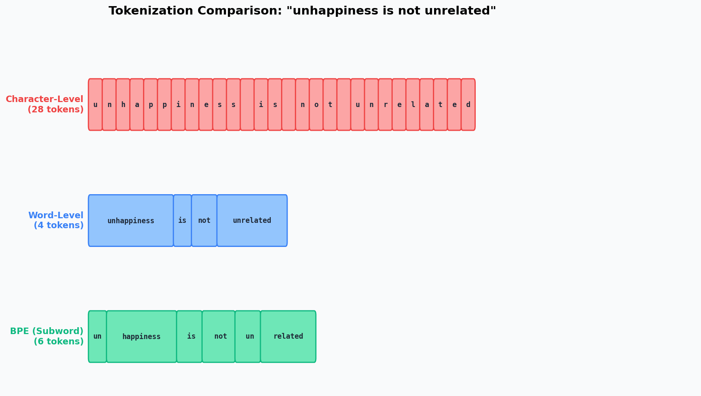
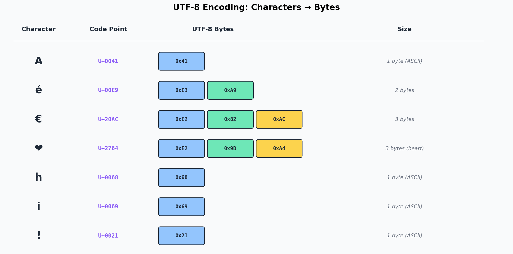
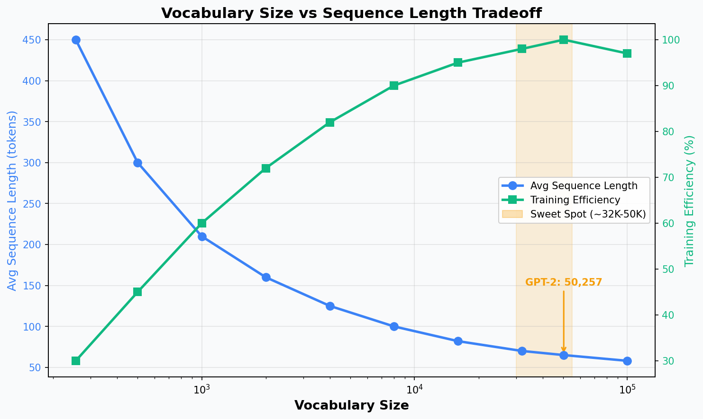
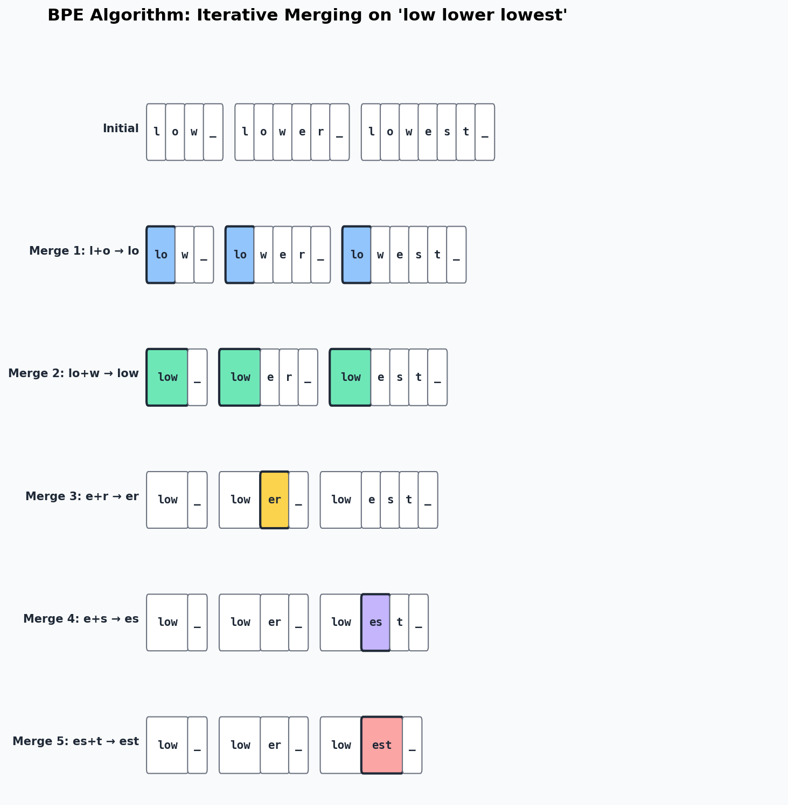
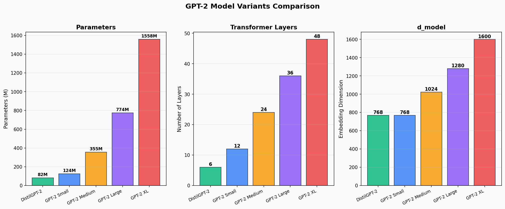
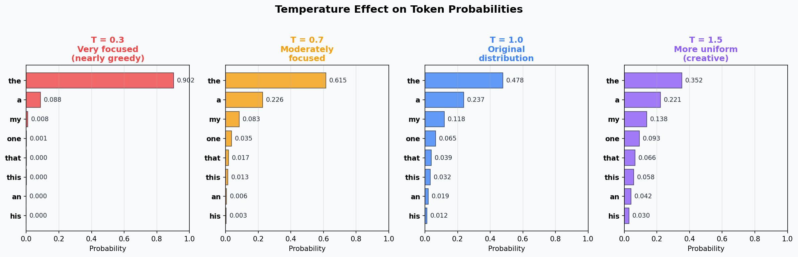
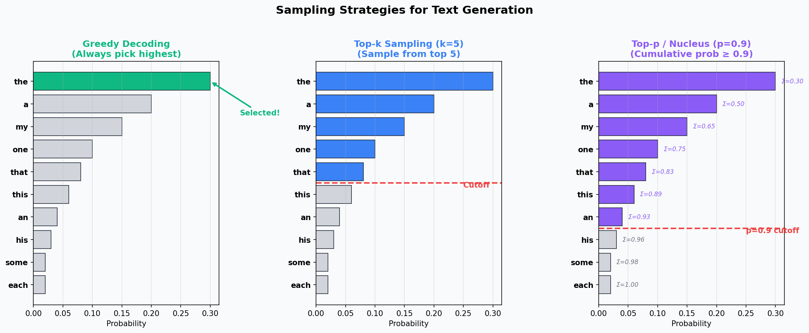

# Day 4: Tokenization & Hugging Face Basics

## The Book - From Raw Text to Token IDs to Generated Text

> **What you need:** Python, PyTorch, transformers, tiktoken, matplotlib
> **What you'll build today:** A BPE tokenizer from scratch + text generation with pre-trained GPT-2 models
> **Time:** ~10 hours

---

## Table of Contents

1. [Why Tokenization Matters](#chapter-1-why-tokenization-matters)
2. [Unicode & UTF-8 Fundamentals](#chapter-2-unicode--utf-8-fundamentals)
3. [The Tokenization Hierarchy](#chapter-3-the-tokenization-hierarchy)
4. [BPE Algorithm Step-by-Step](#chapter-4-bpe-algorithm-step-by-step)
5. [Building a BPE Tokenizer from Scratch](#chapter-5-building-a-bpe-tokenizer-from-scratch)
6. [Byte-Level BPE - GPT-2 Style](#chapter-6-byte-level-bpe---gpt-2-style)
7. [Special Tokens & Vocabulary Design](#chapter-7-special-tokens--vocabulary-design)
8. [Introduction to Hugging Face](#chapter-8-introduction-to-hugging-face)
9. [Loading Pre-trained Models](#chapter-9-loading-pre-trained-models)
10. [Text Generation Deep Dive](#chapter-10-text-generation-deep-dive)
11. [Comparing GPT-2 Variants](#chapter-11-comparing-gpt-2-variants)
12. [Exercises & Experiments](#chapter-12-exercises--experiments)
13. [References & Next Steps](#references--next-steps)
14. [Interview Prep](#interview-prep-key-terms--concepts-for-day-4)

---

## Chapter 1: Why Tokenization Matters

Yesterday you built a Transformer that operates on characters. Real GPT models do not use characters — they use **tokens**, which are subword units created by algorithms like Byte Pair Encoding (BPE).

Tokenization is the very first step in the LLM pipeline:

```
Raw text → Tokenizer → Token IDs → Embedding Layer → Transformer → Predictions
```

Everything the model sees, everything it learns, everything it generates passes through the tokenizer. If your tokenizer is bad, your model will be bad no matter how big it is.

### Why Not Just Use Characters?

Day 3's mini GPT used characters. This works for toy models, but has serious problems at scale:

```
Character-level:
  "transformer" → ['t', 'r', 'a', 'n', 's', 'f', 'o', 'r', 'm', 'e', 'r']
  11 tokens for one word!

BPE subword-level:
  "transformer" → ['transform', 'er']
  2 tokens for the same word!
```

**The problem with characters:**
- Very long sequences (a 1000-word article becomes ~5000 characters)
- Self-attention is O(n²) — doubling sequence length quadruples compute
- Each character carries very little meaning ("t" tells you almost nothing)
- The model must learn to compose characters into words from scratch

### Why Not Just Use Whole Words?

```
Word-level:
  Vocabulary: {"the": 0, "cat": 1, "sat": 2, ...}
  Problem: what about "tokenization"? "unforgettable"? "COVID-19"?
  Either add them all (massive vocab) or mark them [UNK] (lose information)
```

**The problem with words:**
- English has ~170,000+ words in common use
- Technical domains, names, and new words create an unlimited vocabulary
- Misspellings, compound words, and morphological variations all need separate entries
- Any word not in the vocabulary becomes `[UNK]` — total information loss

### The Subword Sweet Spot

Subword tokenization (BPE, WordPiece, Unigram) splits the difference:

```
Common words → single tokens:     "the" → ["the"]
Rare words → meaningful pieces:   "tokenization" → ["token", "ization"]
Unknown words → character-level:  "xyzzy" → ["x", "y", "z", "z", "y"]
```

This gives us:
- **Compact sequences** (shorter than character-level)
- **Open vocabulary** (can represent any text, no UNK tokens)
- **Meaningful units** (subwords often correspond to morphemes)
- **Practical vocab size** (32K-50K tokens is typical)



---

## Chapter 2: Unicode & UTF-8 Fundamentals

Before we build a tokenizer, we need to understand how text is represented in computers. This is more important than you think — GPT-2's tokenizer operates on **bytes**, not characters.

### Characters Are Not Bytes

A character is an abstract concept. The letter "A" is a character. But computers store numbers, not abstract concepts. We need an encoding system.

**Unicode** assigns every character a **code point** — a unique number:

```python
# Python: get the Unicode code point
ord('A')     # 65        (U+0041)
ord('é')     # 233       (U+00E9)
ord('€')     # 8364      (U+20AC)
ord('中')    # 20013     (U+4E2D)
```

Unicode defines over 150,000 characters. Code points range from U+0000 to U+10FFFF.

### UTF-8: Variable-Length Encoding

UTF-8 encodes each code point as 1 to 4 bytes:

| Code Point Range    | Bytes | Pattern              | Example |
|:-------------------|:-----:|:---------------------|:--------|
| U+0000 - U+007F   | 1     | `0xxxxxxx`          | 'A' → `0x41` |
| U+0080 - U+07FF   | 2     | `110xxxxx 10xxxxxx` | 'é' → `0xC3 0xA9` |
| U+0800 - U+FFFF   | 3     | `1110xxxx 10xxxxxx 10xxxxxx` | '€' → `0xE2 0x82 0xAC` |
| U+10000 - U+10FFFF| 4     | `11110xxx 10xxxxxx 10xxxxxx 10xxxxxx` | Emoji → 4 bytes |

```python
# Python: see the bytes
"A".encode("utf-8")      # b'A'         (1 byte)
"é".encode("utf-8")      # b'\xc3\xa9'  (2 bytes)
"€".encode("utf-8")      # b'\xe2\x82\xac' (3 bytes)
"hello".encode("utf-8")  # b'hello'     (5 bytes, all ASCII)
```

**Why this matters for tokenization:**
- GPT-2's tokenizer starts with a base vocabulary of 256 tokens — one for each possible byte value
- This means it can represent ANY text (any language, any emoji) without UNK tokens
- The BPE merges then create subword tokens from common byte sequences



### Python String Exercises

```python
# The relationship between str, bytes, and code points
text = "café"

# str → bytes (encoding)
encoded = text.encode("utf-8")  # b'caf\xc3\xa9'
print(len(text))     # 4 characters
print(len(encoded))  # 5 bytes (é is 2 bytes in UTF-8)

# bytes → str (decoding)
decoded = encoded.decode("utf-8")  # "café"

# Individual bytes as integers
print(list(encoded))  # [99, 97, 102, 195, 169]

# Code points
print([hex(ord(c)) for c in text])  # ['0x63', '0x61', '0x66', '0xe9']
```

---

## Chapter 3: The Tokenization Hierarchy

Let us compare the three main approaches side by side:

### Character-Level Tokenization

```python
text = "unhappiness"
tokens = list(text)
# ['u', 'n', 'h', 'a', 'p', 'p', 'i', 'n', 'e', 's', 's']
# 11 tokens, vocab size ~256 (one per byte or character)
```

**Pros:** Tiny vocab, no OOV, simple implementation
**Cons:** Very long sequences, each token is meaningless, hard for model to learn

### Word-Level Tokenization

```python
text = "unhappiness is unforgettable"
tokens = text.split()
# ['unhappiness', 'is', 'unforgettable']
# 3 tokens, but vocab must include ALL these words
```

**Pros:** Short sequences, each token is meaningful
**Cons:** Huge vocab needed, OOV problem, no morphological sharing ("happy" and "unhappiness" are completely separate)

### Subword Tokenization (BPE)

```python
text = "unhappiness is unforgettable"
# BPE might tokenize as:
tokens = ['un', 'happiness', ' is', ' un', 'for', 'get', 'table']
# 7 tokens, vocab size ~50K, no OOV
```

**Pros:** Balanced sequence length, open vocab, morphological awareness ("un" prefix is shared)
**Cons:** Non-intuitive splits, language-dependent performance, requires training

### The Tradeoff Visualized



The sweet spot for modern LLMs is typically 32,000 to 100,000 tokens:
- GPT-2: 50,257 tokens
- GPT-4: ~100,000 tokens
- LLaMA: 32,000 tokens
- Claude: ~100,000 tokens

---

## Chapter 4: BPE Algorithm Step-by-Step

Byte Pair Encoding was originally a data compression algorithm (Gage, 1994). Sennrich et al. (2016) adapted it for NLP, and OpenAI used it for GPT-2.

### The Algorithm

```
1. Start with a vocabulary of individual characters (or bytes)
2. Count all adjacent pairs in the training corpus
3. Find the most frequent pair
4. Merge that pair into a new token
5. Add the new token to the vocabulary
6. Repeat from step 2 until desired vocab size is reached
```

### Worked Example: "low lower lowest"

Let us walk through BPE on a tiny corpus. We use `_` to represent the end-of-word marker.

**Initial state** (each character is a token):

```
Corpus:  l o w _   l o w e r _   l o w e s t _
Tokens:  [l, o, w, _, l, o, w, e, r, _, l, o, w, e, s, t, _]
```

**Step 1: Count all pairs**

```
(l, o) → 3 times    ← most frequent!
(o, w) → 3 times
(w, _) → 1 time
(w, e) → 2 times
(e, r) → 1 time
(r, _) → 1 time
(e, s) → 1 time
(s, t) → 1 time
(t, _) → 1 time
```

**Merge 1:** `l + o → lo` (frequency 3)

```
Corpus:  lo w _   lo w e r _   lo w e s t _
```

**Step 2: Count pairs again**

```
(lo, w) → 3 times   ← most frequent!
(w, _) → 1 time
(w, e) → 2 times
(e, r) → 1 time
...
```

**Merge 2:** `lo + w → low` (frequency 3)

```
Corpus:  low _   low e r _   low e s t _
```

**Merge 3:** `e + r → er` (frequency 1, but still highest remaining)

```
Corpus:  low _   low er _   low e s t _
```

**Merge 4:** `e + s → es`

```
Corpus:  low _   low er _   low es t _
```

**Merge 5:** `es + t → est`

```
Corpus:  low _   low er _   low est _
```

The final vocabulary is: `{l, o, w, _, e, r, s, t, lo, low, er, es, est}`



### Key Insight

Notice how BPE discovered meaningful subwords:
- `low` — the common stem
- `er` — the comparative suffix
- `est` — the superlative suffix

This is not programmed — it emerges naturally from frequency statistics. The algorithm discovers morphological structure as a side effect of compression.

---

## Chapter 5: Building a BPE Tokenizer from Scratch

Now let us implement this in Python. The full code is in [`bpe_tokenizer.py`](bpe_tokenizer.py).

### The Core Functions

**1. `get_stats()` — Count adjacent pairs**

```python
from collections import Counter

def get_stats(ids):
    """Count frequency of each adjacent pair."""
    counts = Counter()
    for pair in zip(ids, ids[1:]):
        counts[pair] += 1
    return counts
```

This is elegant: `zip(ids, ids[1:])` creates all adjacent pairs. For `[1, 2, 3, 4]`, it yields `[(1,2), (2,3), (3,4)]`.

**2. `merge()` — Replace a pair with a new token**

```python
def merge(ids, pair, new_id):
    """Replace all occurrences of pair with new_id."""
    new_ids = []
    i = 0
    while i < len(ids):
        if i < len(ids) - 1 and ids[i] == pair[0] and ids[i+1] == pair[1]:
            new_ids.append(new_id)
            i += 2  # Skip both elements of the pair
        else:
            new_ids.append(ids[i])
            i += 1
    return new_ids
```

**3. The Training Loop**

```python
class BasicTokenizer:
    def __init__(self):
        self.merges = {}   # (pair) -> new_token_id
        self.vocab = {}    # token_id -> bytes

    def train(self, text, num_merges):
        # Start with raw bytes
        tokens = list(text.encode("utf-8"))

        # Initial vocab: 256 single-byte tokens
        self.vocab = {idx: bytes([idx]) for idx in range(256)}

        for i in range(num_merges):
            stats = get_stats(tokens)
            if not stats:
                break

            # Find most frequent pair
            top_pair = max(stats, key=stats.get)
            new_id = 256 + i

            # Merge
            tokens = merge(tokens, top_pair, new_id)
            self.merges[top_pair] = new_id
            self.vocab[new_id] = self.vocab[top_pair[0]] + self.vocab[top_pair[1]]
```

### Encoding: Applying Learned Merges

To encode new text, we apply the same merges in the same order:

```python
def encode(self, text):
    tokens = list(text.encode("utf-8"))

    while len(tokens) >= 2:
        stats = get_stats(tokens)
        # Find the pair that was merged earliest
        pair = min(stats, key=lambda p: self.merges.get(p, float("inf")))

        if pair not in self.merges:
            break  # No more merges apply

        tokens = merge(tokens, pair, self.merges[pair])

    return tokens
```

The key insight: we always apply the **earliest-learned merge first**. This is because merge order matters — if we learned `(a, b) → ab` before `(ab, c) → abc`, we must apply the first merge before we can even see the second pair.

### Decoding: Token IDs Back to Text

```python
def decode(self, ids):
    byte_seq = b"".join(self.vocab[idx] for idx in ids)
    return byte_seq.decode("utf-8", errors="replace")
```

Decoding is straightforward: look up the bytes for each token ID and concatenate.

### Compression Analysis

Running our tokenizer with different numbers of merges shows how compression improves:

```
Merges  Vocab  Tokens  Ratio
     0    256    1829   1.00x  (raw bytes, no compression)
    50    306    1165   1.57x
   100    356     930   1.97x
   200    456     696   2.63x
   256    512     608   3.01x
```

More merges = better compression, but with diminishing returns. GPT-2 uses ~50,000 merges trained on 40GB of text, achieving much higher compression ratios.

---

## Chapter 6: Byte-Level BPE - GPT-2 Style

GPT-2 introduced an important variant: **byte-level BPE**. Instead of starting with Unicode characters, it starts with raw bytes.

### Why Bytes Instead of Characters?

The problem with character-level BPE:
- Different languages have different character sets
- You need to handle unknown characters somehow
- The initial vocabulary can be huge (Unicode has 150K+ characters)

The byte-level solution:
- Start with exactly 256 tokens (one per byte value)
- Any text in any language can be represented
- No UNK tokens ever — if all else fails, the byte tokens handle it
- Clean, simple starting vocabulary

### GPT-2's Tokenizer Details

```
Base vocabulary:       256 byte tokens (0x00 - 0xFF)
BPE merges:           ~50,000
Total vocabulary:     50,257 tokens
                      (256 base + 50,000 merges + 1 special token <|endoftext|>)
```

GPT-2 also uses a regex-based pre-tokenization step that splits text into words before applying BPE:

```python
import re

# GPT-2's pre-tokenization pattern
GPT2_SPLIT_PATTERN = r"""'(?:[sdmt]|ll|ve|re)| ?\p{L}+| ?\p{N}+| ?[^\s\p{L}\p{N}]+|\s+(?!\S)|\s+"""
```

This pattern ensures that:
- Contractions are split properly: "I'm" → ["I", "'m"]
- Spaces are attached to the following word: " hello" (not "hello")
- Numbers, letters, and punctuation are separated

### Comparing with GPT-2's Real Tokenizer (tiktoken)

```python
import tiktoken

enc = tiktoken.get_encoding("gpt2")

# Our tokenizer (200 merges, ~1KB training data)
our_tokens = our_tokenizer.encode("Hello, World!")
# ['H', 'el', 'lo', ',', ' ', 'W', 'or', 'l', 'd', '!']  ~10 tokens

# GPT-2 (50K merges, ~40GB training data)
gpt2_tokens = enc.encode("Hello, World!")
# ['Hello', ',', ' World', '!']  just 4 tokens!
```

The real GPT-2 tokenizer achieves much better compression because:
1. It was trained on vastly more data
2. It has 250x more merge operations
3. Common words and phrases become single tokens

---

## Chapter 7: Special Tokens & Vocabulary Design

### Special Tokens

Modern tokenizers include special tokens that are not derived from BPE merges but are added explicitly:

| Token | Purpose | Used By |
|:------|:--------|:--------|
| `<\|endoftext\|>` | End of document / sequence | GPT-2, GPT-4 |
| `<\|pad\|>` | Padding for batch alignment | Many models |
| `<\|startoftext\|>` | Beginning of sequence | Some models |
| `[CLS]` | Classification token | BERT |
| `[SEP]` | Separator between segments | BERT |
| `[MASK]` | Masked token for MLM | BERT |
| `<s>`, `</s>` | Start/end of sequence | LLaMA, T5 |

GPT-2 uses only one special token: `<|endoftext|>` (token ID 50256). It serves as both the beginning-of-sequence and end-of-sequence marker.

### Vocabulary Size Tradeoffs

| Vocab Size | Pros | Cons |
|:-----------|:-----|:-----|
| Small (256-1K) | Tiny embedding table, any text representable | Very long sequences, slow training |
| Medium (32K-50K) | Good balance, efficient sequences | Need to train the tokenizer |
| Large (100K+) | Very short sequences | Large embedding table, rare tokens undertrained |

**The embedding table** is one of the model's biggest components:

```
Embedding table size = vocab_size × d_model

GPT-2 Small:  50,257 × 768  = 38.6M parameters (31% of the model!)
GPT-2 XL:     50,257 × 1600 = 80.4M parameters
```

A larger vocabulary means a larger embedding table, which means more parameters that need to be trained. But it also means shorter sequences, which means faster inference (since self-attention is O(n²)).

### The "Tokenization Tax"

Andrej Karpathy calls this the "tokenization tax" — the hidden cost of bad tokenization:

1. **Arithmetic problems:** "123 + 456" might tokenize as ["123", " +", " 456"] or ["12", "3", " +", " 4", "56"]. The model sees different token boundaries for different numbers, making arithmetic harder.

2. **Non-English languages:** English text is typically ~1 token per word, but Japanese or Chinese text can be 2-3x more tokens per character. This means non-English users effectively get less context window.

3. **Code:** Python indentation (spaces) might each be separate tokens, eating up the context window on whitespace.

4. **Trailing whitespace:** "Hello " and "Hello" tokenize differently. The space matters.

---

## Chapter 8: Introduction to Hugging Face

### What is Hugging Face?

Hugging Face is the central platform for the open-source AI community. It provides:

1. **Model Hub** — 500K+ pre-trained models (GPT-2, LLaMA, BERT, Stable Diffusion, etc.)
2. **Datasets Hub** — 100K+ datasets
3. **Transformers Library** — Python library to load and use any model in a few lines
4. **Spaces** — Free hosting for ML demos
5. **Inference API** — Run models without downloading them

### The `transformers` Library

The `transformers` library is the single most important library for a Gen AI engineer. It provides a unified API for loading, fine-tuning, and deploying models.

```python
# The most common pattern:
from transformers import AutoModelForCausalLM, AutoTokenizer

# Load a model + tokenizer in 2 lines
tokenizer = AutoTokenizer.from_pretrained("gpt2")
model = AutoModelForCausalLM.from_pretrained("gpt2")
```

The `Auto` classes automatically detect the model architecture from the name:
- `AutoModelForCausalLM` — for text generation (GPT-2, LLaMA, etc.)
- `AutoModelForSequenceClassification` — for classification (BERT, etc.)
- `AutoModelForTokenClassification` — for NER, POS tagging
- `AutoModelForQuestionAnswering` — for QA tasks

### Key Concepts

| Concept | Description |
|:--------|:------------|
| `from_pretrained()` | Downloads model weights + config from Hub |
| `tokenizer.encode()` | Text → token IDs |
| `tokenizer.decode()` | Token IDs → text |
| `model.generate()` | Autoregressive text generation |
| `model.eval()` | Set model to inference mode (disable dropout) |
| `torch.no_grad()` | Disable gradient computation (faster inference) |

---

## Chapter 9: Loading Pre-trained Models

### Setting Up the Device

Modern deep learning uses GPUs (or Apple Silicon) for acceleration:

```python
import torch

if torch.cuda.is_available():
    device = torch.device("cuda")        # NVIDIA GPU
elif hasattr(torch.backends, "mps") and torch.backends.mps.is_available():
    device = torch.device("mps")         # Apple Silicon
else:
    device = torch.device("cpu")         # Fallback
```

### Loading GPT-2

```python
from transformers import AutoModelForCausalLM, AutoTokenizer

tokenizer = AutoTokenizer.from_pretrained("gpt2")
model = AutoModelForCausalLM.from_pretrained("gpt2")
model = model.to(device)
model.eval()

# Model info
print(f"Parameters: {sum(p.numel() for p in model.parameters()):,}")
# Parameters: 124,439,808

print(f"Vocab size: {tokenizer.vocab_size}")
# Vocab size: 50257

print(f"Max positions: {model.config.n_positions}")
# Max positions: 1024
```

### GPT-2 Variants

| Model | Parameters | Layers | Heads | d_model | Download |
|:------|:-----------|:-------|:------|:--------|:---------|
| `distilgpt2` | 82M | 6 | 12 | 768 | ~330 MB |
| `gpt2` | 124M | 12 | 12 | 768 | ~500 MB |
| `gpt2-medium` | 355M | 24 | 16 | 1024 | ~1.4 GB |
| `gpt2-large` | 774M | 36 | 20 | 1280 | ~3.1 GB |
| `gpt2-xl` | 1558M | 48 | 25 | 1600 | ~6.2 GB |



### Exploring the Tokenizer

```python
# Encode text to token IDs
text = "Hello, World!"
ids = tokenizer.encode(text)
# [15496, 11, 2159, 0]

# See the actual tokens
tokens = tokenizer.convert_ids_to_tokens(ids)
# ['Hello', ',', 'ĠWorld', '!']

# The Ġ character represents a leading space
# "ĠWorld" means " World" (space + World)

# Decode back
decoded = tokenizer.decode(ids)
# "Hello, World!"

# Batch encoding (with attention masks)
batch = tokenizer(["Hello!", "How are you?"], padding=True, return_tensors="pt")
# batch.input_ids:      tensor([[15496,     0, ...],
#                                [2437,   389, ...]])
# batch.attention_mask: tensor([[1, 1, 0, ...],
#                                [1, 1, 1, ...]])
```

---

## Chapter 10: Text Generation Deep Dive

Text generation is autoregressive: the model predicts one token at a time, then feeds its prediction back as input for the next step.

```
Input:  "The cat"
Step 1: Model predicts "sat"  → "The cat sat"
Step 2: Model predicts "on"   → "The cat sat on"
Step 3: Model predicts "the"  → "The cat sat on the"
Step 4: Model predicts "mat"  → "The cat sat on the mat"
```

At each step, the model outputs a probability distribution over the entire vocabulary. How we sample from this distribution dramatically affects the output quality.

### Greedy Decoding

The simplest strategy: always pick the token with the highest probability.

```python
output = model.generate(input_ids, max_new_tokens=50, do_sample=False)
```

**Problem:** Greedy decoding often produces repetitive, boring text. It gets stuck in loops because the most probable next token after "the" is often "the" again.

### Temperature

Temperature scales the logits before softmax, controlling the "sharpness" of the probability distribution:

```python
# Before softmax:
logits = [3.5, 2.8, 2.1, 1.5, 1.0]

# Temperature = 0.5 (sharper — more confident)
scaled = [7.0, 5.6, 4.2, 3.0, 2.0]  # logits / 0.5
# After softmax: [0.76, 0.17, 0.05, 0.01, 0.00]

# Temperature = 1.0 (original)
scaled = [3.5, 2.8, 2.1, 1.5, 1.0]  # logits / 1.0
# After softmax: [0.41, 0.20, 0.10, 0.06, 0.03]

# Temperature = 2.0 (flatter — more random)
scaled = [1.75, 1.4, 1.05, 0.75, 0.5]  # logits / 2.0
# After softmax: [0.28, 0.20, 0.14, 0.10, 0.08]
```

```python
output = model.generate(input_ids, max_new_tokens=50,
                        do_sample=True, temperature=0.7)
```



**Guidelines:**
- `T = 0.1-0.3`: Very deterministic, good for factual Q&A
- `T = 0.7`: Good balance, common default for chat
- `T = 1.0`: Original distribution, maximum diversity
- `T > 1.0`: More random, creative but potentially incoherent

### Top-k Sampling

Only sample from the k most probable tokens, discarding the rest:

```python
output = model.generate(input_ids, max_new_tokens=50,
                        do_sample=True, top_k=50, temperature=0.8)
```

```
Full distribution:  ["the" 0.3, "a" 0.2, "my" 0.15, "one" 0.1, ... 50247 more tokens]

Top-k=5:            ["the" 0.35, "a" 0.24, "my" 0.18, "one" 0.12, "that" 0.11]
                     (renormalized to sum to 1.0, rest discarded)
```

**Problem with top-k:** The ideal k depends on the context. Sometimes the model is very confident (only 2-3 reasonable options), and sometimes it is uncertain (many good options). A fixed k does not adapt.

### Top-p (Nucleus) Sampling

Sample from the smallest set of tokens whose cumulative probability exceeds p:

```python
output = model.generate(input_ids, max_new_tokens=50,
                        do_sample=True, top_p=0.9, temperature=0.8)
```

```
Sorted by probability:
  "the"  0.30  cumsum: 0.30
  "a"    0.20  cumsum: 0.50
  "my"   0.15  cumsum: 0.65
  "one"  0.10  cumsum: 0.75
  "that" 0.08  cumsum: 0.83
  "this" 0.06  cumsum: 0.89
  "an"   0.04  cumsum: 0.93  ← exceeds p=0.9, cut here
  "his"  0.03  (discarded)
  ...
```

Top-p adapts automatically:
- When the model is confident → small nucleus (2-3 tokens)
- When the model is uncertain → large nucleus (many tokens)



### Combining Parameters

In practice, you often combine top-k, top-p, and temperature:

```python
output = model.generate(
    input_ids,
    max_new_tokens=100,
    do_sample=True,
    temperature=0.8,     # Slightly sharpen the distribution
    top_k=50,            # Only consider top 50 tokens
    top_p=0.95,          # Then further trim to 95% cumulative probability
    repetition_penalty=1.1,  # Penalize repeating tokens
)
```

### Beam Search

Instead of sampling, beam search maintains the top B candidates at each step:

```python
output = model.generate(
    input_ids,
    max_new_tokens=50,
    num_beams=5,         # Keep top 5 candidates
    do_sample=False,
    no_repeat_ngram_size=2,  # Prevent repeating bigrams
)
```

Beam search tends to produce more coherent text but can be repetitive. It is commonly used for translation and summarization, not for creative generation.

### The Full `generate()` API

```python
model.generate(
    input_ids,                    # Input token IDs
    max_new_tokens=100,           # Maximum tokens to generate
    min_new_tokens=10,            # Minimum tokens to generate

    # Sampling parameters
    do_sample=True,               # Enable sampling (vs greedy)
    temperature=0.8,              # Distribution sharpness
    top_k=50,                     # Top-k filtering
    top_p=0.95,                   # Nucleus sampling threshold

    # Beam search
    num_beams=1,                  # 1 = no beam search
    early_stopping=True,          # Stop when all beams finish

    # Repetition control
    repetition_penalty=1.1,       # Penalty for repeated tokens
    no_repeat_ngram_size=3,       # Don't repeat 3-grams

    # Stopping
    pad_token_id=tokenizer.eos_token_id,
    eos_token_id=tokenizer.eos_token_id,
)
```

---

## Chapter 11: Comparing GPT-2 Variants

### Perplexity: Measuring Model Quality

**Perplexity** measures how "surprised" the model is by the text. It is defined as:

```
Perplexity = exp(average cross-entropy loss)
```

Lower perplexity = better model. A perplexity of 1 would mean the model perfectly predicts every token.

```python
def measure_perplexity(model, tokenizer, text, device):
    encodings = tokenizer(text, return_tensors="pt").to(device)
    with torch.no_grad():
        outputs = model(encodings.input_ids, labels=encodings.input_ids)
    return torch.exp(outputs.loss).item()
```

### Model Comparison Results

From our experiments in [`huggingface_generate.py`](huggingface_generate.py):

| Model | Parameters | Avg Perplexity | Generation Quality |
|:------|:-----------|:---------------|:-------------------|
| DistilGPT-2 | 82M | Higher | More repetitive, less coherent |
| GPT-2 Small | 124M | Lower | Better coherence, more factual |

Key observations:
- Larger models consistently have lower perplexity on most texts
- The improvement from 82M to 124M parameters is noticeable in generation quality
- DistilGPT-2 is 50% fewer parameters but surprisingly capable for its size
- All GPT-2 variants share the same tokenizer (50,257 tokens)

### DistilGPT-2: Knowledge Distillation

DistilGPT-2 was created through **knowledge distillation**:
1. Train the full GPT-2 (the "teacher")
2. Train a smaller model (the "student") to match the teacher's output distributions
3. The student learns to approximate the teacher's behavior with fewer parameters

This technique is widely used to create smaller, faster models for deployment.

---

## Chapter 12: Exercises & Experiments

### Exercise 1: Extend the BPE Tokenizer
Modify `bpe_tokenizer.py` to:
- Add a pre-tokenization step that splits on whitespace/punctuation before BPE
- Train with 500 merges instead of 100
- Compare compression ratios with and without pre-tokenization

### Exercise 2: Tokenizer Analysis
Using tiktoken, analyze how GPT-2's tokenizer handles:
- Different languages (English vs Spanish vs Japanese vs Arabic)
- Code (Python, JavaScript)
- Numbers and arithmetic (123 + 456 vs 12 + 456)
- URLs and emails

```python
import tiktoken
enc = tiktoken.get_encoding("gpt2")

# Try these:
for text in ["Hello world", "Hola mundo", "こんにちは世界",
             "def foo():\n    return 42", "123 + 456 = 579"]:
    tokens = enc.encode(text)
    print(f"{text:30s} → {len(tokens)} tokens: {[enc.decode([t]) for t in tokens]}")
```

### Exercise 3: Temperature Explorer
Create a script that generates 10 completions at each temperature (0.1, 0.5, 0.7, 1.0, 1.5) for the same prompt, then calculate the diversity (number of unique words across completions). Plot temperature vs diversity.

### Exercise 4: Prompt Engineering with GPT-2
Try different prompt structures and observe how GPT-2 responds:
```python
prompts = [
    "Q: What is the capital of France?\nA:",
    "Translate English to French: hello →",
    "The following is a list of prime numbers: 2, 3, 5, 7,",
    "Once upon a time, in a land far away,",
]
```

### Exercise 5: Build a Simple Chat Interface
Create a loop that:
1. Takes user input
2. Appends it to a conversation history
3. Generates a response with GPT-2
4. Prints the response and loops

---

## References & Next Steps

### References

1. **Sennrich et al., 2016** — "Neural Machine Translation of Rare Words with Subword Units" (BPE for NLP)
2. **Radford et al., 2019** — "Language Models are Unsupervised Multitask Learners" (GPT-2 paper)
3. **Karpathy, 2024** — "Let's build the GPT Tokenizer" (YouTube)
4. **Hugging Face Documentation** — [transformers library](https://huggingface.co/docs/transformers)
5. **tiktoken** — OpenAI's fast BPE tokenizer ([GitHub](https://github.com/openai/tiktoken))
6. **Gage, 1994** — "A New Algorithm for Data Compression" (original BPE paper)

### What You Learned Today

- Why tokenization is the critical first step in the LLM pipeline
- How UTF-8 encodes characters as variable-length byte sequences
- The tradeoffs between character, word, and subword tokenization
- How the BPE algorithm iteratively merges frequent pairs
- How to build a working BPE tokenizer from scratch
- How GPT-2 uses byte-level BPE with 50,257 tokens
- How to load and use pre-trained models with Hugging Face
- How temperature, top-k, and top-p control text generation
- How to measure and compare model quality with perplexity

### Next Steps (Day 5)

Tomorrow you will learn **Prompt Engineering & LLM APIs** — how to effectively communicate with large language models through carefully crafted prompts, and how to use commercial LLM APIs (OpenAI, Gemini, Groq) to build real applications.

---

## Interview Prep: Key Terms & Concepts for Day 4

### Term Definitions

| Term | Definition | Why It Matters |
|:-----|:-----------|:---------------|
| **Tokenization** | Converting raw text into a sequence of token IDs | First step in the LLM pipeline; determines what the model sees |
| **BPE (Byte Pair Encoding)** | Subword tokenization algorithm that iteratively merges the most frequent pair of adjacent tokens | Powers GPT-2, GPT-3, GPT-4 tokenizers |
| **Subword** | A token that is smaller than a word but larger than a character (e.g., "un", "transform", "ation") | Balances vocabulary size against sequence length |
| **Vocabulary** | The complete set of tokens a model can recognize | Determines the embedding table size and what text can be represented |
| **Token ID** | Integer index mapping a token to its embedding vector | What the model actually processes (not strings) |
| **UTF-8** | Variable-length character encoding (1-4 bytes per character) | Standard text encoding; GPT-2 tokenizer operates on UTF-8 bytes |
| **Code Point** | Unicode's unique numeric identifier for each character | U+0041 = 'A', U+1F600 = grinning face emoji |
| **Pre-tokenization** | Splitting text into chunks (words) before applying BPE | Prevents merges across word boundaries |
| **Byte-level BPE** | BPE variant that starts with 256 byte tokens instead of characters | Guarantees no OOV tokens; used by GPT-2 |
| **Special Token** | Non-text token added for model control (EOS, PAD, CLS) | Signals sequence boundaries, enables batching |
| **Temperature** | Scaling factor applied to logits before softmax | Controls randomness: low = deterministic, high = creative |
| **Top-k Sampling** | Only sample from the k highest-probability tokens | Prevents sampling very unlikely tokens |
| **Top-p (Nucleus) Sampling** | Sample from smallest set of tokens with cumulative probability >= p | Adapts dynamically to model confidence |
| **Greedy Decoding** | Always select the highest-probability token | Deterministic but often repetitive |
| **Beam Search** | Maintain top-B candidate sequences at each step | More coherent than greedy but computationally expensive |
| **Perplexity** | exp(average cross-entropy loss); measures model surprise | Lower = better; standard metric for language model quality |
| **Hugging Face Hub** | Platform hosting 500K+ pre-trained models and datasets | Central repository for open-source AI |
| **AutoModel** | Hugging Face class that auto-detects model architecture | `AutoModelForCausalLM.from_pretrained("gpt2")` |
| **from_pretrained()** | Method to download and load model weights from Hub | Key entry point for using any pre-trained model |
| **Knowledge Distillation** | Training a small model to mimic a larger model's outputs | Creates DistilGPT-2, DistilBERT — smaller, faster models |
| **Repetition Penalty** | Multiplicative penalty on tokens that already appeared | Reduces repetitive generation |
| **Context Window** | Maximum number of tokens the model can process at once | GPT-2: 1024, GPT-4: 128K, Claude: 200K |
| **Autoregressive** | Generating tokens one at a time, each conditioned on all previous | How GPT models generate text |
| **Embedding Table** | Matrix mapping each token ID to a dense vector | Size = vocab_size × d_model; large portion of model parameters |
| **Tokenization Tax** | Hidden costs of suboptimal tokenization (more tokens for same text) | Non-English languages, code, and numbers are most affected |
| **WordPiece** | Subword tokenization used by BERT (similar to BPE) | Uses ## prefix for continuation subwords |
| **Unigram** | Probabilistic subword tokenization (alternative to BPE) | Used by SentencePiece, T5, LLaMA |
| **tiktoken** | OpenAI's fast BPE tokenizer library | Production tokenizer for GPT models |
| **OOV (Out of Vocabulary)** | Token not in the vocabulary, replaced with [UNK] | Subword tokenization eliminates this problem |

### Common Interview Questions

**Q1: Why do LLMs use subword tokenization instead of word or character-level?**

A: Subword tokenization (BPE, WordPiece) is the sweet spot between character-level and word-level. Character-level creates extremely long sequences (problematic because attention is O(n²)) and each token carries little meaning. Word-level requires an impossibly large vocabulary and cannot handle new/rare words (OOV problem). Subword tokenization gives compact sequences, open vocabulary (can represent any text), and meaningful token units that often correspond to morphemes. GPT-2 uses ~50K subword tokens to efficiently represent text in any language.

**Q2: Walk me through the BPE algorithm.**

A: BPE starts with a base vocabulary of individual characters (or bytes). Then iteratively: (1) Count all adjacent pairs in the corpus, (2) Find the most frequent pair, (3) Merge that pair into a new token and add it to the vocabulary, (4) Replace all occurrences in the corpus. Repeat for a desired number of merges. To encode new text, apply the same merges in the order they were learned. The result is a subword vocabulary where common words are single tokens and rare words are broken into pieces.

**Q3: What is temperature in text generation and how does it work?**

A: Temperature is a scaling factor applied to the model's output logits before softmax. The formula becomes softmax(logits/T). At T<1, the distribution becomes sharper (more peaked), making the model more deterministic — it strongly favors the most likely token. At T>1, the distribution flattens, making the model more random and creative. At T=1, you get the original learned distribution. T=0.7 is a common default that balances quality and diversity.

**Q4: What is the difference between top-k and top-p sampling?**

A: Both restrict which tokens can be sampled. Top-k keeps only the k highest-probability tokens and redistributes probability among them. The problem is that k is fixed regardless of the model's confidence. Top-p (nucleus sampling) keeps the smallest set of tokens whose cumulative probability exceeds p (e.g., 0.9). This adapts automatically: when the model is confident, the nucleus is small (2-3 tokens); when uncertain, it is large. In practice, top-p is often preferred because it adapts to context.

**Q5: What is perplexity and why does it matter?**

A: Perplexity is exp(average cross-entropy loss) over a text. It measures how "surprised" the model is by the text — lower perplexity means better predictions. A perplexity of 1 would mean perfect prediction. It is the standard metric for comparing language models. For example, GPT-2 Small (~124M params) typically achieves lower perplexity than DistilGPT-2 (~82M params) on the same text, indicating it models language more accurately.

**Q6: What is Hugging Face and why is it important for Gen AI engineers?**

A: Hugging Face is the central platform for open-source AI. It hosts 500K+ pre-trained models, 100K+ datasets, and provides the `transformers` library — a unified Python API for loading and using any model. A typical workflow is: `AutoModelForCausalLM.from_pretrained("gpt2")` downloads the model weights and config, `AutoTokenizer.from_pretrained("gpt2")` loads the matching tokenizer. This lets engineers prototype with state-of-the-art models in minutes rather than weeks.

**Q7: How does GPT-2's byte-level BPE differ from standard BPE?**

A: Standard BPE starts with Unicode characters as the base vocabulary, which can be large and language-dependent. GPT-2's byte-level BPE starts with exactly 256 tokens (one per byte value, 0x00-0xFF). Since any text can be encoded as UTF-8 bytes, this guarantees no out-of-vocabulary tokens ever. The BPE merges then create subword tokens from common byte sequences. GPT-2 applies ~50,000 merges on top of the 256 base tokens, plus one special token (`<|endoftext|>`), for a total vocabulary of 50,257.

### Flashcards

| Front | Back |
|:------|:-----|
| What algorithm does GPT-2 use for tokenization? | Byte-level BPE (Byte Pair Encoding) with 50,257 tokens |
| What is the base vocabulary size for byte-level BPE? | 256 (one token per possible byte value) |
| How does BPE decide which pair to merge? | It merges the most frequent adjacent pair in the corpus |
| What does temperature=0.1 do to text generation? | Makes it very deterministic — strongly favors the most likely token |
| What does temperature=2.0 do? | Flattens the distribution — more random, potentially incoherent |
| What is top-p (nucleus) sampling? | Sample from the smallest set of tokens whose cumulative probability >= p |
| What is perplexity? | exp(average cross-entropy loss) — lower is better |
| What is the Ġ character in GPT-2 tokens? | Represents a leading space: Ġhello = " hello" |
| How many parameters does GPT-2 Small have? | 124M |
| What is `AutoModelForCausalLM`? | HF class that auto-detects and loads a text generation model |
| What is knowledge distillation? | Training a small model to mimic a larger model's outputs |
| What is the "tokenization tax"? | Extra tokens needed for non-English text, code, or numbers due to tokenizer bias |
| What is greedy decoding? | Always picking the highest-probability token at each step |
| Why is beam search not commonly used for chat? | It tends to produce repetitive, "safe" text; sampling is better for creativity |
| What is `from_pretrained()`? | HF method that downloads model weights and config from the Hub |
